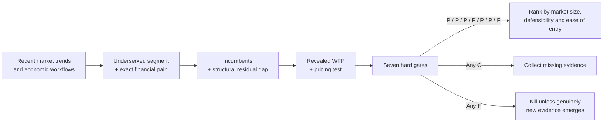
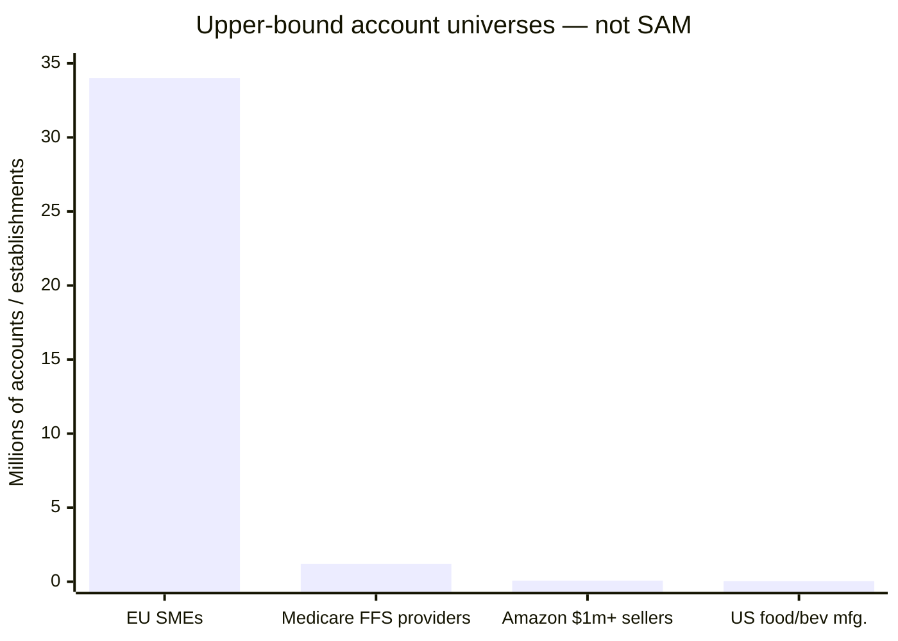
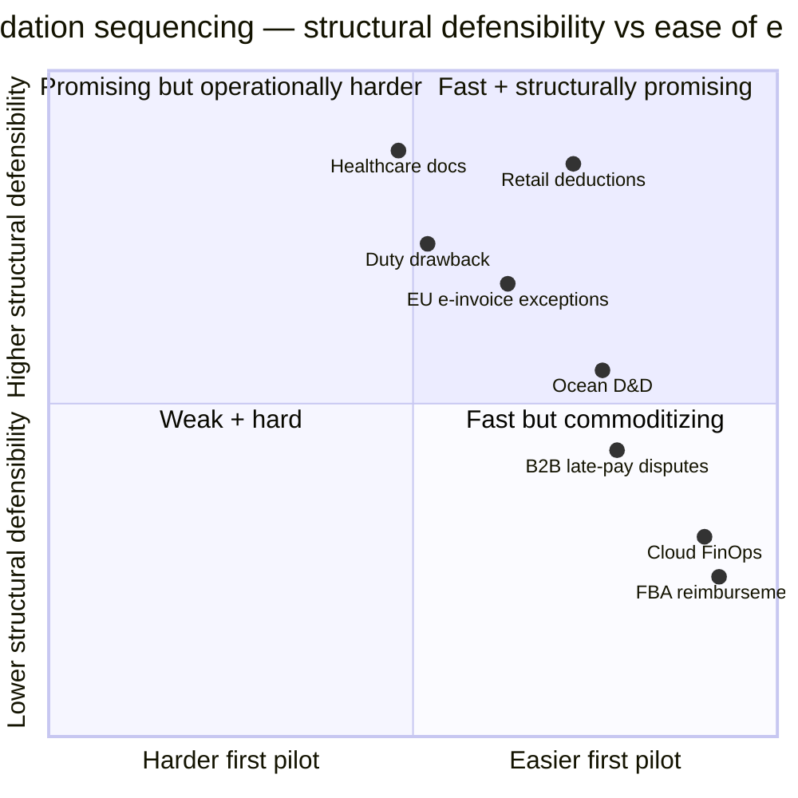

# Deep Research: Finding a Validated Economic Wedge for an Online SaaS Business

## Executive summary

Applying the user's methodology literally changes the answer from “here are attractive SaaS ideas” to a much stricter conclusion: **desk research identifies several strong validation candidates, but none can yet honestly be called a fully validated economic wedge.** The uploaded methodology requires seven non-compensating gates—account-level incidence, per-account economic exposure, software controllability, revealed willingness to pay, residual grievance among incumbent users, conservative residual market capacity, and GTM accessibility—and explicitly says only a P/P/P/P/P/P/P candidate may be called validated. It also forbids substituting broad TAM statistics, reviews, or hypothetical ROI for those tests. fileciteturn0file0

That distinction matters because the financial bar in the methodology is unusually high: the central mature-revenue objective is about **₹800 crore annually**, and a strong wedge should expose at least **₹4,000 crore of conservative residual ARR capacity**. Using the RBI's July 2026 INR/USD reference of about ₹95.72 per dollar, those are roughly **$83.6 million annual revenue and $417.9 million residual ARR capacity**, respectively. fileciteturn0file0 citeturn8search0

After following the requested sequence—recent trends → underserved segments → incumbents/structural gaps → monetization → hard gates before prioritization—the three candidates that deserve the **first validation budget** are:

| Validation priority | Exact economic wedge | Why it survives desk research | Critical evidence still missing |
|---|---|---|---|
| **A** | Retail deduction evidence, dispute and prevention layer for CPG/manufacturing suppliers selling through large retailers | Direct financial evidence shows customer deductions/chargebacks are real; retailer documentation reveals structural data and authority boundaries; value can be measured in recovered cash. citeturn2search0turn2search12turn5search3turn5search6 | Account-level incidence, P25 loss, and incumbent-user residual-loss sample |
| **B** | Pre-service documentation-completeness engine for Medicare-heavy specialty providers | CMS finds very high documentation-related improper-payment exposure in several specialties; 2026–27 prior-authorization reforms make required documentation and denial reasons more machine-readable. citeturn0search0turn0search2turn3search0turn3search3 | Map CMS claim-level statistics to provider-level economic exposure and prove residual loss among modern RCM users |
| **C** | EU e-invoice exception/rejection repair for multi-country, multi-ERP mid-market firms | ViDA and national mandates make e-invoicing a compulsory workflow; 34 million EU SMEs create a huge account universe; jurisdictional fragmentation is persistent. citeturn9search0turn9search1turn12search6 | Quantified rejection incidence and evidence that Pagero/SAP/Avalara/Sovos users still suffer a structural, rather than merely feature-level, failure |

The highest-confidence recommendation is therefore **not yet “build A.” It is “validate A first, B second, C third, and refuse to build until one passes the seven gates.”** Candidate A currently has the best combination of measurable cash outcome, read-only entry architecture and a plausible structural opening. Candidate B has arguably the largest economic stakes but materially harder data/privacy/GTM. Candidate C has the cleanest regulatory tailwind and a very fast file-based MVP, but its incumbent-risk is substantially higher because Thomson Reuters Pagero already reports more than 65,000 active e-invoicing customers across 90+ jurisdictions, while SAP is actively rolling country-specific e-invoicing functionality into its own compliance stack. citeturn15search0turn15search3turn15search7

Several superficially appealing opportunities should be deprioritized. Generic cloud FinOps is easy to enter but AWS itself now consolidates optimization recommendations and specialist competitors offer read-only, success-fee commitment optimization, eroding any structural opening. citeturn1search0turn21search2turn21search4 Ocean demurrage/detention has excellent regulatory and dollar evidence, but by 2026 several startups already market essentially the exact audit-and-dispute loop. citeturn6search5turn21search0turn21search5turn21search12 Amazon FBA reimbursement has similarly become less attractive because Amazon began automatically reimbursing most basic lost/damaged and return cases while specialist providers already handle complex exceptions on contingency. citeturn7search0turn21search11

The resulting strategic thesis is narrow: **the best SaaS wedge is likely to be a read-only financial-exception product that reconstructs economic truth across systems or counterparties, produces an auditable action packet, and proves recovered/prevented dollars in days—not another horizontal AI dashboard.** That conclusion follows directly from the methodology's structural-opening and minimally profitable MVP requirements. fileciteturn0file0

## Method and evidence standard

The research followed the user's five steps in the requested order, with the uploaded methodology's seven hard gates inserted before final prioritization. Pages 1–5 of the methodology define the unit of analysis as an exact economic failure, rather than a generic pain point; page 14 makes the P/C/F seven-gate comparison mandatory; and pages 15–16 require a read-only, measurable, minimally profitable first product rather than a broad platform. fileciteturn0file0

The exact workflow analyzed for every candidate is:

**trigger → transaction/data → decision → action → exception/failure → workaround → financial consequence → attempted resolution → final economic outcome.**

The hard gates are deliberately non-compensating. Incidence needs a known numerator, denominator and period with a 95% lower confidence bound of at least 10%; economic exposure requires P25 and median per-account exposure, with P25 normally at least 10× required ACV; controllability requires root causes explaining at least 80% of exposure and at least 25% conservatively software-controllable; willingness to pay must be revealed through actual spending; residual grievance must persist among incumbent users; residual ARR must clear the methodology's capacity threshold without requiring more than 15% penetration; and the entry motion should produce first measurable value from read-only/historical data in roughly ten business days. fileciteturn0file0

This immediately constrains what can be concluded from public data. For example, CMS publishes statistically robust **claim-level** improper-payment rates, but that does not establish the percentage of independent provider organizations affected or their P25 annual exposure. Similarly, the FMC publishes billions of dollars of demurrage and detention collections, but those figures do not tell us the P25 recoverable loss of an importer already using a modern freight-audit stack. Those candidates therefore remain conditional even where the aggregate economics are compelling. citeturn0search2turn6search5

The evidence hierarchy has also been preserved. Regulatory datasets, corporate filings, government reports and official product documentation carry most of the argument. Vendor material is used primarily to establish current incumbent capabilities, adoption and pricing—not prevalence. The methodology explicitly prohibits passing a hard gate from reviews, promotional studies or generic analyst TAM reports alone. fileciteturn0file0

## Recent SaaS trends and niche-opportunity screen

The most relevant trend is not simply “AI adoption.” It is **AI becoming a standard incumbent feature**, which makes model quality alone a poor basis for defensibility. SAP introduced AI assistants for autonomous AP, payment exceptions and invoice processing in 2026; AWS's Cost Optimization Hub already consolidates rightsizing, idle-resource and Savings Plan/reservation recommendations; Waystar, R1 and HighRadius are embedding AI directly into denial, authorization and deduction workflows. citeturn17search0turn17search2turn1search0turn4search17turn3search7turn5search14 A startup therefore needs a data, authority, workflow-position, regulatory or cross-organizational boundary—not “our LLM is better.”

A second trend is **regulation creating structured machine-readable entry points into historically manual financial workflows**. CMS's 2024 interoperability rule requires affected payers to implement prior-authorization APIs, provide specific denial reasons and meet tighter decision requirements, with major API provisions generally taking effect in 2027. citeturn3search0turn3search3 The EU adopted VAT in the Digital Age in March 2025, with mandatory cross-border B2B digital reporting/e-invoicing milestones progressing toward 2030 while individual countries impose earlier domestic mandates. citeturn9search0turn9search1turn15search7 The FMC likewise tightened the informational and timing requirements around demurrage and detention invoices. citeturn6search0turn6search2 These developments favor software that audits exceptions around structured transactions rather than software that tries to replace the system of record.

A third trend is the continued economic importance of **post-automation exception work**. Retail suppliers still encounter deductions whose resolution depends on contracts, proof-of-delivery, promotion terms, retailer-specific codes and sometimes an escalation outside the normal dispute portal. SPS/ SupplyPike's own documentation notes, for example, that certain partially paid Walmart claims cannot simply be disputed again and may require case-by-case escalation. citeturn5search3turn5search6 In healthcare, CMS continues to find documentation to be a dominant cause of improper payments in multiple categories: Medicare FFS's FY2025 improper-payment estimate was $28.83 billion; DMEPOS alone had a 24.12% rate and $2.27 billion of estimated improper payments; and CMS attributes 77.17% of Medicaid improper payments to insufficient documentation. These are not equivalent to provider-denial losses, but they establish an unusually large documentation-control problem. citeturn0search0turn0search2

A fourth trend is **outcome-based pricing becoming easy for buyers to understand when the economic result is objectively auditable**. Cloud-optimization vendor LevelFour publicly prices optimization at 30–35% of savings while its governance module costs $599–$1,499 per month; Usage.ai prices on realized savings and advertises read-only installation; FBA recovery specialist GETIDA starts at 20% of reimbursements; and the D&D recovery entrant Sellexio advertises a 20% recovery fee. citeturn21search2turn21search4turn21search11turn21search5 These are direct demonstrations that “pay for objectively verified money recovered/saved” is commercially intelligible, although each new wedge still needs its own WTP evidence.

The niche screen consequently focused on eight money-moving workflows rather than broad software categories:

| Economic pool | Candidate exact failure |
|---|---|
| Revenue leakage | Retailer deduction is taken but supplier cannot quickly prove validity/invalidity and assemble the correct recovery evidence |
| Denied revenue | Service/order proceeds with incomplete payer-required documentation, causing avoidable authorization/claim failure |
| Regulatory invoicing | Structurally valid commercial invoice fails country/network/customer-specific e-invoice acceptance |
| Working capital | Undisputed or disputed B2B invoice remains unpaid while evidence and approvals are fragmented |
| Logistics spend | D&D invoice includes an invalid or challengeable charge but evidence is scattered across carrier/terminal/contract records |
| Infrastructure spend | Company buys too much/too little cloud commitment because workload demand changes faster than commitment architecture |
| Customs recovery | Eligible imported/exported merchandise is not correctly matched into a drawback claim |
| Marketplace recovery | Amazon seller has a valid manual reimbursement exception after Amazon's automated process finishes |

The upper-bound account universes are large in several cases, but they are deliberately **not treated as SAM**. The EU now has about 34 million SMEs; Medicare MACs served more than 1.2 million enrolled FFS healthcare providers in FY2024; Amazon says more than 75,000 independent sellers exceeded $1 million in annual sales in 2025; and USDA/Census counted 42,708 U.S. food-and-beverage manufacturing establishments in 2022. citeturn12search6turn19search3turn7search1turn20search0

The chart's main analytical message is caution: **a huge denominator is easy to find; the methodology requires the much smaller denominator of accounts with the exact residual, software-controllable, monetizable failure after competent incumbents are already installed.** fileciteturn0file0

## Underserved segments and competitor gaps

The most promising customer segments are not customers with no software. They are customers with sophisticated software who still pay humans to resolve economically material exceptions. That is where structural openings can be separated from mere feature gaps.

**Retail deduction recovery and prevention.** The target ICP is a manufacturer/CPG supplier with meaningful sales through large retailers and enough deduction volume to employ AR/deduction analysts or outsource parts of the process. Direct filings prove the workflow carries real money: Packaging Corporation of America reported a $10.8 million customer-deduction reserve and noted returns, allowances and earned discounts historically averaging roughly 1% of gross selling price; Hain Celestial explicitly discusses unauthorized customer deductions and chargeback receivables it expects to reclaim. citeturn2search0turn2search12 Existing solutions are formidable. HighRadius offers deduction capture, validity prediction and trade-promotion matching; SPS/ SupplyPike automates many Walmart/Target dispute workflows. citeturn5search14turn5search18turn5search20turn5search7

The plausible opening is therefore **not “better deduction management.”** It is the residual job after those systems run: reconstructing evidence across ERP/EDI, proof-of-delivery, retailer portals, pricing/promotion contracts and buyer approvals; routing exceptions that cannot be resolved through the standard dispute mechanism; and feeding the validated root cause back into order/pricing/logistics processes so the same deduction stops recurring. SPS's own Walmart documentation is important here because it demonstrates an authority boundary: after some claims are approved and partially paid, the supplier cannot simply file another portal dispute and instead has to pursue the issue case-by-case. citeturn5search3turn5search6 That is structurally more interesting than a missing UI feature.

**Healthcare documentation failure prevention.** The underserved segment should initially be Medicare-heavy DMEPOS, ambulance, podiatry and other documentation-intensive outpatient providers—not “all healthcare RCM.” CMS's DMEPOS estimate is unusually stark: a 24.12% improper-payment rate and roughly $2.27 billion of projected improper payments in FY2025. CMS separately reported an 11.2% improper-payment rate for podiatry in 2024, with 76.4% associated with insufficient documentation; ambulance improper-payment analysis likewise identifies insufficient documentation as the largest cause. citeturn0search2turn0search5turn0search6 The strongest interpretation is not that all those dollars are recoverable provider revenue; it is that documentation is demonstrably a repeated, high-value failure mechanism.

Waystar, R1 and Experian already automate prior authorization, eligibility, denial prevention and payer-rule management. Waystar reports tens of millions of authorization transactions; R1 markets both authorization automation and automated denial/AR resolution; Experian maintains payer-rule and prior-authorization workflows. citeturn4search0turn3search7turn3search8turn4search5 The potential structural opening is earlier and narrower: **before an authorization or claim is submitted, reconstruct whether the required evidence actually exists across order, referral, clinical note, test result and coverage-rule documents, and tell the operator exactly which evidence is absent.** CMS's API reforms improve the feasibility of that model because payers must expose more requirements and denial information electronically. citeturn3search0turn3search3

**EU e-invoice exception and rejection repair.** ViDA was adopted in March 2025 and establishes an EU-wide trajectory toward structured digital reporting, but implementation remains jurisdictionally heterogeneous. Germany, for example, already requires businesses to receive structured invoices and moves larger companies toward mandatory issuance in 2027; Slovakia is implementing structured invoices plus real-time digital reporting from 2027; Belgium introduced domestic B2B e-invoicing in 2026. citeturn9search0turn15search3turn15search7turn15search20

The incumbent field is exceptionally strong. Thomson Reuters says ONESOURCE Pagero now serves more than 65,000 active e-invoicing customers across 90+ jurisdictions and connects to a network reaching roughly 14 million companies; SAP offers country-localized Document and Reporting Compliance; Avalara and Sovos maintain jurisdiction-specific regulatory content. citeturn15search0turn15search3turn15search17 The only potentially defensible wedge is therefore **the exception layer between source ERP master data, local tax/e-invoice rules and recipient-specific acceptance**: explain why a technically generated document will fail or has failed, reconstruct the semantic error, propose an auditable correction, and prevent recurrence across multiple ERPs/entities. This is a hypothesis, not yet a proven structural opening. If incumbent-user research shows that these failures are merely missing validation rules that Pagero/SAP can ship easily, the candidate must be killed.

**B2B late-payment/dispute evidence.** The EU Payment Observatory reports that more than half of European companies experienced late-payment difficulties in 2024 and that average B2B and government-to-business payment periods exceeded 60 days. The Commission also reported that 52% of firms experienced late payments in 2024, up five percentage points. citeturn12search1turn12search3 The problem is real but its controllability is questionable: the Observatory notes that larger companies tend to pay later and that firms often accept longer terms than they prefer, pointing toward bargaining power rather than a pure software defect. citeturn12search0 Upflow already automates collections, payments, cash application and increasingly AP-portal interaction. citeturn12search5turn12search7 A viable wedge would need to prove that a large fraction of delay is caused specifically by missing acceptance/dispute evidence that software can change; otherwise Gate Three should fail.

**Ocean D&D recovery.** The FMC reports that nine ocean carriers collected about $15.4 billion in demurrage and detention charges from April 2020 through March 2025. U.S. rules impose invoice-information and timing requirements that can directly determine payment obligations. citeturn6search5turn6search0turn6search2 This looked attractive early in the screen because invoice + contract + terminal-event data creates a textbook audit packet. However, the niche is already rapidly filling: AuditDray, Sellexio, MiraLedger and DockLedger now market line-level D&D auditing and dispute-pack generation; Sellexio advertises a 20% success fee. citeturn21search0turn21search5turn21search10turn21search12 Unless interviews uncover a narrower structural failure those products cannot solve, this exact wedge no longer has convincing whitespace.

**Cloud commitment risk.** The 2025 FinOps Foundation survey covered teams responsible for more than $69 billion of cloud spend and found optimization/waste reduction remained a major priority. citeturn1search2 But AWS itself offers Savings Plan/reservation recommendations, while Usage.ai and LevelFour already provide read-only, multi-cloud commitment optimization with success-fee pricing and extremely rapid setup. citeturn1search0turn21search2turn21search4 This is evidence of excellent WTP and GTM—but also evidence that the proposed opening has largely been occupied. A startup that merely forecasts volatile AI/GPU workloads more accurately would be betting on a copyable feature.

**U.S. duty drawback.** The structural mechanics are attractive: CBP allows electronic drawback claims, and GAO found persistent weaknesses in matching export evidence to claims; as of September 2024, CBP's projected plan for a complete electronic proof-of-export system was expected to take at least 12 years. citeturn14search12turn16search0 This is a genuine data-boundary problem. However, the latest rigorous aggregate economic figure found by GAO was roughly $1 billion of annual refunds. Even a theoretically maximal 20% vendor capture would imply only about $200 million per year—less than the methodology's roughly $418 million conservative residual-ARR-capacity requirement—before reachability and competitive reductions. citeturn16search0 The 2025–26 tariff regime may have increased the pool materially, but the methodology prohibits assuming that without current evidence.

**Amazon FBA manual reimbursement exceptions.** Amazon reported more than 75,000 independent sellers exceeding $1 million in annual sales in 2025, so the customer base is real. citeturn7search1turn7search6 However, Amazon changed the economics in 2025 by automatically reimbursing most warehouse lost/damaged and customer-return cases, leaving narrower manual-claim windows and exceptions. citeturn7search0 GETIDA already audits complex discrepancy types and starts pricing at 20% of recovered reimbursements. citeturn21search11 That combination of platform dependency, shrinking residual work and mature specialist competition makes this a poor candidate for the methodology's required long-term structural defensibility.

## Monetization, market capacity, and candidate comparison

The methodology's pricing logic is especially useful here. A defensible ACV is not “what SaaS companies usually charge”; it is:

**min(observed WTP ceiling, relevant pricing benchmark, 20% × residual economic value/account).**

Residual ARR capacity is then:

**eligible accounts × lower-bound incidence × reachable share × defensible ACV.**

The 20% value-capture ceiling and the ≥5× residual-capacity requirement come directly from the uploaded research policy. fileciteturn0file0

Accordingly, “TAM” below means an **observable account or economic-pool ceiling**, while “SAM” means the conservative residual monetizable market required by the methodology. Where incidence, P25 exposure or incumbent residuals are absent, the correct answer is “unproven,” not a made-up dollar number.

| Candidate wedge | Target segment / top pain | Existing competitors | Structural feature gap hypothesis | TAM proxy / conservative SAM status | Monetization / proposed price test | Defensibility | Ease of entry | Recommended next step |
|---|---|---|---|---|---|---|---|---|
| **A. Retail deduction evidence + prevention** | CPG/manufacturing suppliers to large retailers; short-paid invoices, evidence gathering, deadlines, recurring root causes | HighRadius; SPS/ SupplyPike. citeturn5search12turn5search14turn5search7 | Data spans ERP/EDI/POD/promotion terms/retailer portals; some resolutions require buyer/EBS authority outside standard dispute path. citeturn5search3turn5search6 | U.S. food/beverage alone has 42,708 establishments as an upper-bound pool; exact affected-company count and residual ARR **unproven**. citeturn20search0 | Paid audit $5k–$15k; then $2k–$8k/mo + 10–15% of verified recovery, subject to 20% residual-value ceiling | **High hypothesis** | **High-medium**: historical exports and docs can work read-only | Recruit 30 incumbent-using suppliers; obtain 100+ closed deduction cases and quantify P25 residual loss |
| **B. Specialty healthcare documentation completeness** | Medicare-heavy DME/outpatient/ambulance/specialty providers; missing evidence before authorization/claim submission | Waystar, R1, Experian. citeturn4search0turn3search7turn4search5 | Required truth lives across payer rule + order/referral + EHR/clinical docs; long-tail specialty requirements persist before transaction submission | Medicare FFS improper-payment pool $28.83B; DMEPOS $2.27B, but these are **not provider-denial SAM**. Exact residual ARR unproven. citeturn0search0turn0search2 | $5k–$20k paid diagnostic; $1k–$5k/site/mo or $1–$3 targeted order/claim. Avoid contingency pricing initially | **High hypothesis** | **Medium**: PHI/security and EHR access add friction | Build account-level sample of ≥100 organizations; prove P25 collectible exposure and three-org intervention evidence |
| **C. EU e-invoice rejection/repair layer** | Multi-country mid-market firms with multiple ERPs/entities; rejected/delayed structured invoices | Thomson Reuters Pagero, SAP DRC, Avalara, Sovos. citeturn15search0turn15search3turn15search17 | Semantic/master-data/customer-specific acceptance sits across ERP, tax rule and network; country heterogeneity may create persistent exception layer | EU has ~34M SMEs, but multi-country ICP and incumbent-user rejection rate are unproven. citeturn12search6 | €2k–€10k readiness diagnostic; €500–€2k/mo + €0.05–€0.30/document | **Medium** until residual gap proven | **High-medium**: start with files/API validation, no transmission license | Sample 100 multi-country firms already using modern provider; quantify rejection/repair incidence and manual hours |
| **D. B2B invoice-dispute evidence / late-payment escalation** | EU SMEs selling to larger firms/government; cash delayed while disputes and approvals remain unresolved | Upflow, HighRadius, collections software. citeturn12search5turn12search7 | Potential organizational/authority boundary between seller AR and buyer AP/portal | 52% of European firms reported late payments in 2024; exact software-controllable dispute subtype is unknown. citeturn12search3 | $99–$1k/mo; optional 5–10% recovery on objectively disputed cases | **Low-medium**: much pain may be bargaining power | **High** | Root-cause 200 late invoices; kill if <25% of exposure is software-controllable |
| **E. Ocean D&D invoice audit/recovery** | Importers/NVOCCs; invalid free-time, tariff or timing charges | AuditDray, Sellexio, DockLedger, freight auditors. citeturn21search0turn21search5turn21search12 | Originally regulatory/data boundary; exact job is now directly addressed by new entrants | $15.4B collected over five years, ≈$3.08B/yr average gross pool; residual monetizable share unknown. citeturn6search5 | 10–20% recovered; Sellexio publicly charges 20%. citeturn21search5 | **Medium but collapsing** | **High** | Do not build generic version; search only for a narrower unserved carrier/geography/workflow |
| **F. Cloud commitment-risk optimization** | $1M–$20M cloud-spend firms; unused/poorly timed commitments | AWS native tools, Usage.ai, LevelFour, Archera. citeturn1search0turn21search2turn21search4turn1search6 | No convincing unique structural opening; specialists already rebalance commitment risk | FinOps 2025 respondents manage >$69B cloud spend; residual niche size not established. citeturn1search2 | 15–30% of savings; current vendors advertise ~30–35% success fees and/or subscription modules. citeturn21search2 | **Low-medium** | **Very high** | **Kill generic wedge**; reopen only with proprietary data or transaction position incumbents cannot replicate |
| **G. U.S. duty-drawback evidence matching** | Importer/exporters eligible for tariff refunds; matching import/export proof is manual/fragmented | Customs brokers; Descartes/global-trade tools. citeturn13search11turn13search12 | Genuine export-proof/data boundary; CBP itself lacks complete automated export-proof matching. citeturn16search0 | Historical refunds ≈$1B/year; theoretical 20% capture ≈$200M, below methodology's ≈$418M capacity bar. citeturn16search0turn8search0 | $5k–$25k diagnostic + 10–20% recovered | **High** | **Medium** | **Fail G6 on currently evidenced pool**; reopen only after obtaining 2026 post-tariff refund data |
| **H. Amazon FBA exception reimbursement** | Larger FBA sellers; residual claims Amazon does not auto-reimburse | GETIDA, Refunzo and similar recovery tools. citeturn21search11turn11search1 | Platform-specific exception knowledge, but incumbent specialists already handle proof/POD complexity | >75k U.S. sellers exceed $1M sales; remaining manual-claim exposure after 2025 automation unknown. citeturn7search1turn7search0 | 15–25% recovery; GETIDA starts at 20%, Refunzo advertises 15%. citeturn21search11turn11search1 | **Low** | **Very high** | **Kill unless** a new manual exception has a structurally inaccessible dataset/position |

The formal public-evidence gate status is therefore deliberately conservative:

| Workflow | G1 incidence | G2 exposure | G3 control | G4 WTP | G5 incumbent residual | G6 capacity | G7 GTM | Evidence confidence | Structural opening | Desk-research disposition |
|---|---:|---:|---:|---:|---:|---:|---:|---|---|---|
| Retail deductions | C | C | C | C | C | C | C | B/C | Data + authority boundary | **Validate first** |
| Healthcare documentation | C | C | C | C | C | C | C | A/B/C | Data + long-tail regulatory boundary | **Validate second** |
| EU e-invoice exceptions | C | C | C | C | C | C | C | A/B | Jurisdiction + architecture hypothesis | **Validate third** |
| B2B late-payment disputes | C | C | C | C | C | C | C | A/B/C | Authority/organizational hypothesis | Validate root causes before product work |
| Ocean D&D | C | C | C | C | **F/C** | C | C | A/B/C | Opening now heavily occupied | Deprioritize generic wedge |
| Cloud commitment risk | C | C | C | C | **F** | C | C | B/C | No unique structural opening demonstrated | Kill generic wedge |
| Duty drawback | C | C | C | C | C | **F on evidenced pool** | C | A/B | Genuine data boundary | Reopen only with new 2026 market evidence |
| FBA reimbursement | C | C | C | C | **F/C** | C | C | B/C | Core workflow increasingly automated/served | Deprioritize |

**P = passed; C = conditional/unproven; F = failed.** This table is intentionally less exciting than a conventional SaaS ranking. That is what the methodology requires: a persuasive aggregate statistic does not turn into a pass unless the exact gate criterion is evidenced. fileciteturn0file0

Because no row is P/P/P/P/P/P/P, a formal market-attractiveness ranking would violate the user's own methodology. The following scatterplot is therefore a **validation-sequencing view**, not a declaration that the candidates are validated wedges. Coordinates are analytical judgments about how quickly a read-only first test could be run and how plausible the structural opening presently looks; they are not empirical gate scores.

## Validation priorities and top-wedge playbooks

**Retail deduction evidence, recovery and prevention**

The proposed persona is a **Director of Accounts Receivable/Deductions, Controller or VP Finance at a CPG/manufacturing supplier that sells through several large retailers**. The organization already has an ERP/EDI stack and may already use SupplyPike, HighRadius or a BPO. The qualifying pain is not “we process deductions manually”; it is “after our existing system has classified/routed the deduction, people still have to reconstruct evidence and pursue money through retailer-specific exceptions, and the same root cause keeps creating deductions.” Direct corporate filings establish that deductions/chargebacks can be economically material, while retailer workflow documentation establishes the multi-system and authority boundaries. citeturn2search0turn2search12turn5search3turn5search6

**Five interview questions**, deliberately using the uploaded methodology's last-occurrence/artifact structure:

| Question | Gate being tested |
|---|---|
| “Take me through the most recent deduction that your existing software did **not** resolve cleanly, from retailer notice to final cash outcome.” | G5 residual grievance |
| “Over the last 12 months, how many deductions reached this exact residual state, and what dollars were involved?” | G1 incidence + G2 exposure |
| “For the last ten cases, which root cause actually drove the money—pricing/promotion mismatch, shortage/POD, compliance fee, duplicate deduction, buyer approval, or something else?” | G3 controllability/Pareto |
| “Show me, redacted, every file/system the analyst opened for one case and the artifact eventually accepted by the retailer.” | G3 + G7 data access |
| “What do you currently pay in software, BPO or analyst labor for this job, and who could authorize a 30-day paid read-only recovery audit?” | G4 revealed WTP + G7 |

A sample outreach message:

> **Subject: 30-minute research interview on unresolved retailer deductions**
>
> I am researching one narrow finance workflow: deductions that remain unresolved after the existing ERP/deduction platform has already done its job. I am not looking to demo software. I want to reconstruct one recent case from deduction notice to final cash outcome, including what evidence your team had to assemble and which system/vendor could not finish the job. I would also like to understand annual frequency, dollars at risk and the approval path for a read-only historical audit. Redacted examples are sufficient. I can share the resulting workflow/root-cause benchmark with participants.

The **minimally complete MVP** should accept historical deduction/ERP/EDI exports, retailer notices and supporting PDFs; normalize a deduction case; retrieve/link PO, invoice, POD/BOL, promotion terms and correspondence; produce an evidence-backed validity decision; identify the correct dispute/escalation route and deadline; generate a human-approved recovery packet; track verified cash recovered; and record a root-cause code that can be aggregated into a prevention Pareto. It should not initially automate external financial actions, replace the ERP or attempt every retailer. That follows the file's “read-only first → auditable output → human approval → complete narrow loop” rule. fileciteturn0file0

The first GTM channels should be direct outbound to controllers/AR leaders at suppliers visibly selling to two or more major retailers; partnerships with EDI/ERP consultants and deduction BPOs that lack proprietary software; and a paid “historical deduction leakage audit” rather than a free SaaS trial. A good first contract is 30–45 days, one retailer or business unit, fixed paid diagnostic plus an optional recovery component, with a production decision date agreed at signing.

The proposed pricing experiment is **$5,000–$15,000 for the first diagnostic**, followed by **$2,000–$8,000 per month plus 10–15% of incremental, objectively verified recoveries** where customer procurement accepts an outcome component. Price must still be capped by the methodology's 20% share of residual economic value. fileciteturn0file0

**Twelve-month operating projection — not TAM evidence**

| Scenario | Month-twelve live customers | Recurring revenue assumption | One-time onboarding/diagnostic | Year-one recognized revenue | Exit annualized recurring revenue |
|---|---:|---:|---:|---:|---:|
| Conservative | 6 | $4,000/customer/month | $5,000/customer | **≈$178k** | **≈$288k** |
| Likely | 18 | $4,000/customer/month | $5,000/customer | **≈$494k** | **≈$864k** |
| Optimistic | 40 | $4,000/customer/month | $5,000/customer | **≈$1.07M** | **≈$1.92M** |

These scenarios assume a gradual monthly customer ramp and treat $4,000 as blended recurring revenue; they are execution planning scenarios, not proof of market capacity.

**Risk assessment.** The biggest risk is that what looks structural is actually already solved for the economically attractive accounts by HighRadius/SPS plus internal process discipline. HighRadius publicly claims substantial touchless deduction resolution, and SupplyPike already automates many retailer dispute flows. citeturn5search14turn5search7 The candidate should be killed if an incumbent-user sample cannot show a ≥20% lower-bound residual affected rate, if the P25 residual value does not support ACV at ≥10× exposure/price headroom, or if most unresolved money is ultimately determined by retailer negotiating power rather than observable evidence. The second risk is services intensity: evidence retrieval may become bespoke analyst work. Manual delivery is acceptable initially only if repeated work can demonstrably become reusable software and paid pilots remain contribution-positive after shadow-pricing the labor. fileciteturn0file0

**Healthcare pre-service documentation completeness**

The initial persona is a **Revenue Cycle Director, Prior Authorization Director or CFO at a Medicare-heavy DMEPOS or documentation-intensive specialty provider**. The workflow begins before submission: an order or scheduled service triggers coverage/document requirements; evidence is scattered through referral/order/EHR documents; the organization sends an incomplete package or cannot prove medical/documentation requirements; an authorization/claim fails or staff spend substantial time repairing it.

CMS data make this especially attractive for falsification research. DMEPOS's FY2025 improper-payment rate was 24.12% with about $2.27 billion of projected improper payments, while CMS's specialty reports identify insufficient documentation as a dominant contributor in podiatry and ambulance. citeturn0search2turn0search5turn0search6 The limitation is crucial: an “improper payment” is not automatically a provider's recoverable denial, so it cannot be inserted directly into a revenue TAM model.

**Five interview questions:**

| Question | Gate being tested |
|---|---|
| “Walk me through the last service/order that failed because documentation was absent, insufficient or could not be found—starting before authorization and ending with the final payment outcome.” | G2/G5 |
| “How many cases with that exact cause did the organization have last month and last year, and how many ultimately lost or delayed payment?” | G1/G2 |
| “Which missing evidence categories account for most dollars, and in what source system or document should each item have existed?” | G3 root-cause coverage |
| “After Waystar/R1/Experian/your clearinghouse/EHR has done its job, what does a human still open, read, call or assemble?” | G5 |
| “Could you provide a redacted historical export plus clinical/order documents for a paid read-only analysis, and which privacy/security/procurement approvals would that require?” | G4/G7 |

Sample outreach:

> **Subject: Research on documentation-driven authorization/claim failures**
>
> I am studying one narrow RCM failure: cases where payment or authorization fails because required evidence is missing or cannot be assembled even after the existing RCM/authorization stack has run. This is research, not a product demo. I am looking for a 30-minute walkthrough of one recent case, annual frequency/dollars, the systems involved and what the human team still had to do. Redacted documents are sufficient. I am particularly interested in whether a read-only historical analysis could identify failures before submission.

The MVP should ingest read-only order/authorization/claim data plus a constrained set of clinical/referral documents; retrieve payer/service-specific evidence requirements; produce an auditable requirement-to-document matrix; mark each requirement present/absent/ambiguous; link every conclusion to source evidence; generate a human-approved “ready/not-ready and why” packet; and track whether flagged cases subsequently avoided a denial or repair cycle. The software should **not** initially make medical-necessity decisions, alter clinical records or autonomously submit transactions.

CMS's 2027 prior-authorization API direction is a tailwind because impacted payers must make documentation requirements and denial information more available electronically, potentially reducing the cost of maintaining payer-rule intelligence. citeturn3search0turn3search3 It is simultaneously a competitive risk because Waystar/R1/Experian can consume the same standardized interfaces.

The primary GTM channels are DME/specialty billing organizations, RCM consultants, direct outreach to revenue-cycle executives, and paid historical “documentation leakage studies.” Unlike retail deductions, outcome-contingent healthcare pricing should not be the default until legal/compliance review is complete; a fixed subscription or per-order model is cleaner.

A sensible initial price test is **$5,000–$20,000 for a historical diagnostic**, then **$1,000–$5,000 per site/month** or roughly **$1–$3 per in-scope order/claim**, whichever better aligns with the workflow's observed economics.

| Scenario | Month-twelve live sites | Recurring revenue assumption | Initial fee per site/account | Year-one recognized revenue | Exit annualized recurring revenue |
|---|---:|---:|---:|---:|---:|
| Conservative | 8 | $2,500/site/month | $3,000 | **≈$142k** | **≈$240k** |
| Likely | 25 | $2,500/site/month | $3,000 | **≈$460k** | **≈$750k** |
| Optimistic | 60 | $2,500/site/month | $3,000 | **≈$993k** | **≈$1.80M** |

**Risk assessment.** This candidate has the highest risk of confusing a large regulatory statistic with a monetizable customer loss. CMS improper-payment measurements can include overpayments and failures that do not translate to collectible provider revenue, so Gate Two must use actual provider financial outcomes rather than multiplying CMS's $28.83 billion headline by a software-capture percentage. citeturn0search0turn0search2 There is also meaningful PHI/security friction and a clinical-judgment boundary: if most residual dollars turn on medical necessity, coverage policy or clinician behavior that software cannot safely change, Gate Three fails. Finally, large RCM incumbents already automate substantial portions of authorization and denial workflows, so interviews must prove a persistent **pre-submission evidence-completeness job among incumbent users**, not merely dissatisfaction with current interfaces. citeturn4search0turn3search7turn4search5

**EU e-invoice exception and rejection repair**

The proposed persona is the **Tax Director, Head of Finance Systems, Controller or e-Invoicing Program Manager at a mid-market company operating through several EU entities and more than one ERP/accounting stack**. The exact grievance is not “e-invoicing compliance is complex.” It is: a legally required structured invoice is generated but fails, is rejected or requires human repair because source master data, tax semantics, jurisdictional schema rules and recipient/network requirements disagree.

The timing is favorable. ViDA was adopted in 2025, EU implementation progresses toward mandatory cross-border digital reporting from 2030, and individual countries are already imposing their own earlier obligations. citeturn9search0turn9search1 Germany's staged regime, Slovakia's 2027 mandate and Belgium's 2026 structured-invoice regime illustrate why firms can face several simultaneous rule sets before the EU-wide end state arrives. citeturn15search3turn15search7turn15search20

**Five interview questions:**

| Question | Gate being tested |
|---|---|
| “Show me the last structured invoice that failed or required manual correction after your existing provider/ERP had generated it.” | G5 |
| “How many such exceptions occurred in the last month/year, out of how many in-scope invoices?” | G1 |
| “What was the final consequence—payment delay, staff time, customer escalation, tax/compliance remediation—and what did it cost?” | G2 |
| “Which system or party held the data that ultimately fixed the issue, and why did your incumbent not resolve it automatically?” | G3/G5 structural cause |
| “Could a third party validate historical invoice files/configuration read-only, and who can authorize a paid 30-day diagnostic?” | G4/G7 |

Sample outreach:

> **Subject: Research interview — e-invoice exceptions after the compliance platform**
>
> I am researching a narrow failure in EU e-invoicing: invoices that still reject or require manual repair after the ERP/e-invoicing provider has generated or validated them. I am not selling a replacement access point or tax platform. I would like to reconstruct one recent exception, the systems/data involved, business impact and why the incumbent could not resolve it. A redacted XML/UBL/Factur-X example plus rejection message is ideal. I can share an anonymized exception taxonomy with participants.

The MVP should remain intentionally outside the transmission layer: ingest XML/UBL/CII/Factur-X or ERP export; detect the applicable country/regime; run schema and semantic validation; compare source master data to required fields; parse rejection responses; explain the likely root cause in business language; suggest a human-approved correction; retain an auditable rule/evidence trail; and show recurring root causes by entity/ERP/customer. Avoid becoming a certified transmission provider at first; partner with Peppol/access-point and existing compliance networks instead.

The first channels are SAP/Business Central/NetSuite implementers, tax-advisory boutiques, Peppol-access-point partners and mandate-specific readiness audits. A low-friction paid wedge is a **historical exception/readiness diagnostic** covering one or two countries before expanding to continuous validation.

The price test should start around **€2,000–€10,000 for the diagnostic**, then **€500–€2,000 per month plus €0.05–€0.30 per validated document**, depending on volume and jurisdiction count. The fact that Thomson Reuters reports tens of thousands of active paying e-invoicing customers establishes category-level budget existence, but not WTP for this exact residual exception layer. citeturn15search0

| Scenario | Month-twelve live customers | Recurring revenue assumption | Onboarding/diagnostic | Year-one recognized revenue | Exit annualized recurring revenue |
|---|---:|---:|---:|---:|---:|
| Conservative | 10 | €1,200/month | €2,000/customer | **≈€98k** | **≈€144k** |
| Likely | 35 | €1,200/month | €2,000/customer | **≈€312k** | **≈€504k** |
| Optimistic | 90 | €1,200/month | €2,000/customer | **≈€835k** | **≈€1.30M** |

**Risk assessment.** The central risk is incumbent feature creep. Thomson Reuters Pagero already operates across more than 90 jurisdictions, and SAP is shipping local e-invoice support within its core compliance products; Deloitte and Thomson Reuters are also packaging e-invoicing as an end-to-end managed offering. citeturn15search0turn15search3turn15search5 A startup cannot claim defensibility merely because country rules are complicated. Gate Five should pass only if current incumbent users repeatedly show a residual failure caused by cross-system/customer-specific boundaries that the incumbent is positionally unable or economically disinclined to own. If the recurring answer is “SAP/Pagero just needs another rule or connector,” this candidate fails the methodology's structural-differentiation test and should be killed.

## Decision and execution roadmap

The research produces a clear **validation order but not yet a validated-wedge ranking**:

**Retail deductions → healthcare documentation completeness → EU e-invoice exception repair.**

Retail deductions should be tested first because the economic result—cash recovered or deduction prevented—is directly auditable; required historical artifacts can usually be exported without replacing an ERP; corporate filings establish that the economic phenomenon is real; and retailer-specific documentation shows credible data/authority boundaries even after specialist automation exists. citeturn2search0turn2search12turn5search3turn5search6

Healthcare should receive the second validation stream because its potential financial stakes and regulatory tailwinds are greater, but the gap between **claim-level improper-payment data** and **provider-level monetizable exposure** is too important to hand-wave away. citeturn0search0turn0search2 It should leapfrog retail deductions only if a representative provider sample quickly shows high P25 collectible exposure and ≥25% genuinely software-controllable root causes.

EU e-invoice exception repair deserves a parallel but cheaper validation effort because the first proof can be done almost entirely from historical invoice/rejection files. The market/regulatory denominator is enormous, but the hurdle is not demand—it is **structural differentiation from Thomson Reuters, SAP, Avalara, Sovos and national/network infrastructure**. citeturn12search6turn15search0turn15search3

The immediate validation program should preserve the uploaded methodology's evidence standard rather than lowering it to accommodate startup speed:

| Workstream | Required output before product commitment | Kill condition |
|---|---|---|
| Incidence | ≥100 independent ICP organizations or population-quality data; exact numerator/denominator/period; Wilson interval | 95% lower bound <10% |
| Economics | Case-level P25, median and P75 annual exposure with double counting removed | P25 cannot support required ACV with ≥10× headroom |
| Root causes | Pareto explaining ≥80% of economic exposure | Controllable share <25% |
| Revealed WTP | Existing external spend plus paid diagnostic customers | Only hypothetical “would pay” evidence |
| Incumbent residual | 15–20 interviews per homogeneous segment plus direct artifacts and quantitative incumbent-user evidence | Residual is merely “missing feature X” |
| Market capacity | Bottom-up `N × incidence_low × reachable_share × defensible_ACV` model | Conservative capacity <₹4,000cr or target requires >15% penetration |
| GTM | Historical/read-only pilot, measurable financial result ≤10 business days, paid entry path ≤45 days | Core-system replacement or >90-day implementation needed |

Those thresholds are exactly why neither a giant EU SME count nor a $28.83 billion Medicare statistic is sufficient by itself. fileciteturn0file0

The ideal first commercial loop for all three candidates is the same architecture specified on pages 15–16 of the methodology:

**historical/read-only data → independent analysis → auditable financial finding → customer verification → paid result → deeper integration only after trust.** fileciteturn0file0

That implies a disciplined build/no-build rule. Do not begin with dashboards, autonomous writes, broad workflow automation or a “platform.” Begin with the smallest loop that proves money: one deduction recovered/prevented, one documentation-driven failure caught before submission, or one structured-invoice exception correctly reconstructed before it delays cash. Every recommendation must link to evidence; every pilot must be paid; manual analyst work must be shadow-priced; and contribution margin must be positive rather than hidden behind founder labor. fileciteturn0file0

The principal portfolio-level risk is **false structural differentiation**. In 2026, major SaaS vendors are rapidly embedding agents, exception handling and continuous compliance into incumbent systems: SAP is automating AP exceptions, AWS is absorbing FinOps recommendations, RCM vendors are automating denials/authorizations, HighRadius is expanding deduction agents, and global e-invoicing providers are consolidating compliance coverage. citeturn17search2turn1search0turn3search7turn5search14turn15search0 The durable opportunity is therefore not “AI applied to workflow X.” It is a **structural economic position** where truth remains fragmented across systems or counterparties, incumbents cannot safely execute the last mile, and a new vendor can demonstrate recovered/prevented dollars from historical data before asking the customer to replace anything. That is the standard the three priority candidates must now meet before any one of them earns the label **validated economic wedge**.