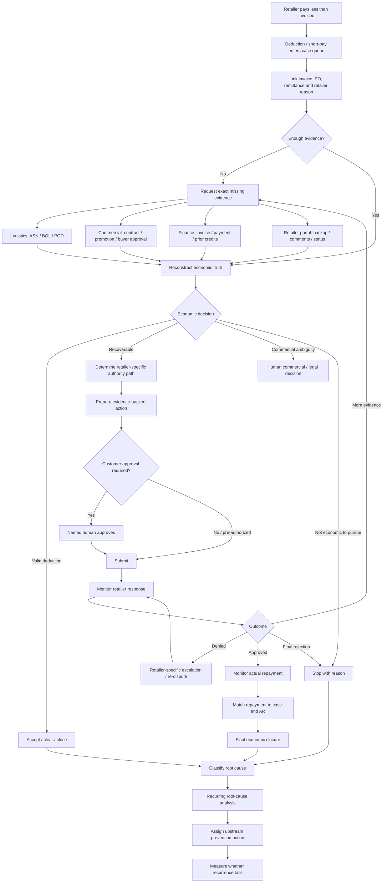

# Non-Technical Prerequisites for a Retail Revenue Resolution OS

## Executive summary

My conclusion is that the hardest prerequisite for a Retail Revenue Resolution OS is **not the software**. It is creating an operating environment in which the system is allowed to establish economic truth and move a case all the way to finality.

The product can only eliminate unresolved retailer deductions when five organizational conditions are true at the same time:

**I have one accountable owner for the economic outcome; I can obtain the evidence needed to reconstruct what happened; I know who has authority to make each internal and retailer-side decision; I have explicit rules for pursue/settle/stop; and every case has a clock, an owner, and a definition of “finished.”**

That conclusion is strongly supported by current operating evidence. Colgate-Palmolive's current Credit-to-Cash roles explicitly require collaboration among Commercial teams, Account Managers, Finance, Logistics and retail partners to resolve discrepancies and obtain documentation; its analysts manage promotional, pricing, compliance and inventory deductions across multiple retailer portals under strict deadlines. citeturn1search1turn1search12 Unilever's Trade Claims role similarly sits between Finance, Key Account/Commercial teams, partner teams and customer operations, with responsibility for escalations, root-cause analysis, corrective action and timely cash clearing. citeturn10view2 Campbell's current deductions role is explicitly responsible for root-cause analysis, cash recovery, write-offs, deduction-reduction initiatives and cross-functional work with Sales, Finance and business teams. citeturn8search1

The retailer side makes the organizational problem even clearer. Walmart can require a buyer rather than APDP for some classes of deductions; the buyer has authority to approve a repayment but is not required to do so. Target contractual deductions can require buyer approval before a dispute can proceed. Home Depot does not formally permit a normal re-dispute after denial and instead exposes an “Open a Dialog”/ticket route. Amazon imposes sequencing rules around its inventory-matching and re-dispute processes. Kroger has category-specific economic eligibility thresholds. citeturn0search8turn10view11turn10view13turn7search0turn10view16

So the final product is not merely:

> **AI that decides whether a deduction is valid.**

It is:

> **A case-resolution operating system that knows what happened, what evidence establishes it, who has authority to change the outcome, what action is economically rational, when that action must occur, and whether the case ultimately ended in cash recovery or correct closure.**

For the MVP, however, I do **not** need to create this organizational machinery from scratch for a customer. I need to select customers where enough of it already exists and then impose a lightweight operating contract around the missing pieces.

That is directly consistent with the methodology already established for this project: the preferred first-customer architecture is **historical/read-only data → independent analysis → measurable result → customer verifies → customer pays → deeper integration later**, with customer approval retained for consequential external actions. The methodology also explicitly permits substantial manual operations in the MVP, provided the pilot is paid, economically measurable and contribution-positive. fileciteturn0file0

**The single most important qualification criterion for my first pilot is therefore not “does this company have deductions?” It is:**

> **Can one Finance/O2C sponsor give me an unresolved case population, evidence access, named Logistics and Commercial escalation contacts, retailer-portal access or a human operator with access, and authority to run a controlled resolution experiment?**

If yes, I can operate the MVP.

If solving one case requires negotiating separately with seven departments before I am even allowed to see the evidence, I do not have an MVP customer; I have an enterprise transformation project. The methodology explicitly warns against that type of GTM architecture. fileciteturn0file0

## Operating ownership and cross-functional handoffs

### The organizational design I need

The evidence does **not** support making the deductions analyst the sole owner of everything. Current supplier job descriptions show that deductions are inherently cross-functional: Finance owns the receivable and accounting outcome; Logistics owns shipment facts; Commercial owns trade terms and buyer relationships; specialist/O2C teams orchestrate cases; and third-party teams may perform first-line processing. citeturn1search12turn10view2turn8search0

I would therefore establish one case captain but several evidence/authority owners.

| Function | What I need it to own | Why it matters | Typical obstacle | Concrete prerequisite | Readiness signal |
|---|---|---|---|---|---|
| **Finance / AR** | Dollar exposure, receivable status, write-off/credit treatment, payment reconciliation, final financial closure | A case is not resolved merely because a dispute was filed; Finance is the function that can verify whether the economic result actually occurred. Current C2C roles explicitly track, resolve and reconcile deductions and maintain documentation for audit. citeturn1search17 | AR data and retailer-resolution work are separated; someone disputes while someone else applies cash | Name one AR owner; define original amount, open amount, recovered amount, write-off amount and final closure state | I can trace a case from original deduction through remittance/credit and final AR clearing |
| **Order-to-Cash / Deductions** | End-to-end case orchestration, queue management, retailer workflow, escalation and SLA | This is the natural case-management owner. Colgate describes its C2C team as resolving deductions across portals and coordinating Finance, Logistics, Commercial and retail partners. citeturn1search1turn1search12 | Team is measured on volume cleared rather than economic outcome; BPO and internal teams split responsibilities | Give one person authority to request evidence, assign actions and escalate overdue handoffs | Every open case has one case captain regardless of which department currently owes the next action |
| **Logistics / Supply Chain** | ASN, BOL, POD, carrier information, shipment quantities, receiving discrepancy context | Shortage and compliance cases cannot be reconstructed without shipment evidence. HighRadius and SPS both organize deduction workflows around retrieving BOL/POD and other shipping documents. citeturn10view5turn10view7 | Documents live in carrier portals, 3PL systems, warehouses, shared drives or multi-page scans | Name a Logistics evidence owner and define where each proof type lives and how it is requested | A PO can be submitted and the relevant shipment evidence returned predictably without ad hoc searching |
| **Sales / Commercial / KAM** | Pricing history, promotions, retailer agreements, buyer approvals, relationship escalation | Certain deductions are governed by commercial agreements and some retailer routes explicitly require buyer authority. Target contractual deductions require buyer approval before repayment can proceed; Walmart buyer disputes have an explicit relationship/goodwill dimension. citeturn10view11turn0search8 | Sales views deductions as Finance's problem; buyer contact is relationship-sensitive; agreement lives in someone's email | Identify named account owner for each retailer; document when the OS may request buyer escalation and who approves it internally | Commercial commits to a response SLA and will provide contracts/approvals rather than becoming an unbounded blocker |
| **Legal** | Ambiguous contract interpretation, settlement/release terms, confidentiality/data terms for the pilot | Legal should be an exception authority, not a routine deduction operator. Contract terms can determine whether a deduction is valid, and the pilot itself needs explicit confidentiality/data-deletion and action-authority terms. citeturn10view8 fileciteturn0file0 | Every contract question is routed to Legal, creating queue latency | Define a materiality/ambiguity threshold above which Legal is invoked; standard cases remain under Finance/Commercial playbooks | Legal is “on call” for defined exceptions rather than required to touch every case |
| **IT / Data owner** | Permission to export historical data, establish shared evidence access, approve credential-sharing method | Modern tools already ingest portal, email, ERP and document data; the MVP does not need production write access to prove value. SPS provides CSV exports, while HighRadius manages retailer/email credentials and aggregates claims from multiple sources. citeturn5search0turn10view5 | Security process treats a read-only pilot like a core-system replacement | Agree on read-only CSV/XLSX plus approved document-share method; use customer-controlled credentials or customer-operated portal step initially | I receive usable historical data without an ERP project |
| **Procurement / Vendor management** | Startup onboarding, PO/vendor setup, BPO contract/SOW boundaries | This is usually a **buying and third-party-governance role**, not the owner of deduction economics. Unilever explicitly describes trade-claims work involving partner teams, third parties and SOWs. citeturn10view2 | Procurement/security cycle becomes longer than the experiment | Use a tightly scoped paid diagnostic/SOW with fixed period, defined data, fixed deliverable and production decision date | A pilot can be purchased without first negotiating an enterprise-wide platform agreement |

### The cross-functional handoff rule

The OS cannot accept:

> “Finance asked Logistics.”

as a meaningful case state.

I need every cross-functional handoff to contain five things:

**the case ID, the amount at risk, the exact question being asked, the exact evidence/action required, and the due date.**

The recipient must respond with either the requested artifact, an explicit business decision, or an explicit reason it cannot be supplied.

That sounds simple, but it is the bridge between “workflow software” and actually eliminating unresolved deductions.

Unilever's current process description makes the underlying problem explicit: its Trade Claims analyst has to navigate differing departmental priorities, influence commercial teams to respond quickly, coordinate partner teams and conduct root-cause analysis. citeturn10view2 The OS should therefore make those handoffs **case objects with clocks**, rather than email conversations.

My MVP RACI would be:

| Case event | Accountable | Required contributor |
|---|---|---|
| Deduction enters queue | O2C / Deductions | AR |
| Determine claimed reason | O2C | AR |
| Shipment truth required | O2C | Logistics |
| Price/promotion truth required | O2C | Commercial |
| Contract interpretation ambiguous | Finance/Commercial | Legal |
| Buyer intervention required | Commercial | O2C |
| Retailer dispute submission | O2C | Customer-approved operator |
| Settlement/write-off | Finance | Commercial if relationship-sensitive |
| Cash received | AR | O2C |
| Recurring root cause | O2C process owner | Functional owner of cause |

**MVP readiness test:** I should be able to put five unresolved deductions on a screen and identify the accountable owner and next-action owner for all five in under ten minutes. If nobody can do that, organizational ambiguity is itself the first problem I have to solve.

## Evidence, authority, and decision protocols

### I need an evidence chain, not merely a document repository

The OS needs enough evidence to answer:

> **What was ordered, what terms applied, what was shipped, what was received, what was invoiced, what was paid, why was money withheld, and what happened after we challenged it?**

The relevant evidence is distributed by business process:

| Evidence | Typical business owner | What it proves |
|---|---|---|
| Purchase order | Customer operations / EDI / ERP | Quantity, cost, SKU, ship-to, order conditions |
| ASN | Logistics / EDI | What supplier says was shipped |
| BOL / POD | Logistics / carrier / 3PL | Shipment transfer/delivery evidence |
| Invoice | AR / billing | What supplier charged |
| Remittance / deduction record | AR / retailer portal | What retailer paid/withheld and claimed |
| Promotion / supplier agreement | Commercial / TPM / Sales | Discount, allowance, promotion and effective terms |
| Buyer approval | Commercial / email / retailer portal | External commercial authorization where required |
| Retailer correspondence | O2C / portal / email | Denial reason, evidence request, status and next procedural step |
| Internal emails | Sales / Logistics / Finance | Exceptional agreements, factual clarification and prior commitments |
| Final payment / credit | AR | Whether economic recovery actually happened |

This evidence architecture is already implicit in incumbent workflows. HighRadius advertises aggregation from customer portals, emails, remittance, ERPs and promotion systems, and links POD/BOL evidence to cases. citeturn10view5 SPS's Document Explorer exists because supplier shipping evidence is frequently fragmented across internal repositories, large scanned files and other locations. citeturn10view7 Walmart supplier agreements themselves include shipping, payment, discounts/allowances and return terms and are used to assess the validity of multiple deduction codes. citeturn10view8

My non-technical prerequisite is therefore an **evidence ownership map**:

> For every evidence type, I know who owns it, where it normally lives, how I ask for it, and how quickly it can be produced.

I do **not** need every document centralized before the MVP. I need retrieval to be predictable.

### Retailer authority is part of the product

One of the strongest conclusions from the research is that “valid/invalid” is insufficient.

I also need:

> **Which actor is permitted to change this outcome?**

The authority map differs materially by retailer.

| Retailer | Authority / procedural boundary I need to model | Operating implication |
|---|---|---|
| **Walmart** | AP deductions run through APDP, but certain codes may effectively require buyer repayment rather than ordinary APDP resolution. SPS states buyer approval is discretionary, and an approved-but-partially-paid case cannot simply be disputed again; the follow-up moves to Walmart EBS/support. Walmart also exposes a two-year deduction dispute window in current SPS workflow documentation. citeturn0search8turn7search13turn7search19 | “Dispute denied” is not necessarily end state. The OS must know whether next authority is APDP, buyer, EBS or closure. |
| **Target** | Contractual/TVI deductions can require buyer approval before payback; repeated invalid denials can escalate through Target's AP route. General deductions can be disputed for up to 18 months, while compliance has a much shorter 90-day window according to current SPS documentation. citeturn10view11turn3search9turn3search8 | Commercial ownership is a prerequisite for some cases. The system cannot treat Finance as having unilateral authority. |
| **Home Depot** | Home Depot does not officially offer a normal re-dispute after denial; suppliers can “Open a Dialog” and can later raise a Supplier Hub ticket. Supplier Action requests carry a response obligation. citeturn10view13turn7search16 | Denial needs retailer-specific branch logic rather than a generic “appeal” button. |
| **Amazon** | Current SPS documentation says shortage claims cannot be disputed during the first 35 days after invoice due date; SPS recommends the following five days as the optimal submission period, and shortage claims have a two-year outer window. Denied/partially approved shortages now have a re-dispute sequence before some settlement routes. citeturn10view15turn7search2turn7search9 | Sometimes the correct action is **wait**, not dispute. Retailer procedural state is part of economic reasoning. |
| **Kroger** | Supplier Connect imposes dispute-type rules, and current SPS documentation says most deductions under $100 are not eligible, with specific exceptions for pickup allowances and ORAD. citeturn10view16 | Some cases should be stopped automatically because retailer rules make recovery uneconomic or unavailable. |

This is why the end-state product needs an **authority graph** alongside the evidence graph.

### My pursue / settle / stop protocol

The decision protocol should not be “AI confidence > 80% → dispute.”

I would operate four states:

| Decision | Required condition |
|---|---|
| **Pursue** | Evidence reasonably supports supplier entitlement; a viable retailer route exists; the case is within procedural window; expected recovery materially exceeds remaining handling/escalation cost |
| **Investigate** | Economic exposure is material but one or more decisive facts are missing and can realistically be obtained within the available time |
| **Settle / commercial escalation** | Supplier has a defensible claim, but outcome depends materially on commercial discretion, ambiguous contract language, relationship cost or negotiated compromise |
| **Stop / close** | Deduction is substantively valid, evidence cannot overcome the retailer position, procedural route has expired, amount is below actionable threshold, or expected value of further work is negative |

The distinction between “economically correct” and “technically disputable” is important. Walmart's own process as documented by SPS explicitly tells suppliers considering buyer disputes to account for the goodwill/social-capital cost of approaching a buyer and to use that route for deductions they know to be invalid. citeturn0search8 SPS also exposes “archive” behavior for deductions that a supplier elects not to pursue, while some retailer processes make claims outright ineligible. citeturn5search4turn10view16

For my MVP, **all settle, buyer-escalation and write-off recommendations remain human-approved**. That matches the existing methodology's requirement that consequential external or financial actions be customer-approved until reliability has been established. fileciteturn0file0

### Commercial approval matrix

I would require the customer to establish something this simple before launch:

| Action | Example authority |
|---|---|
| Ordinary evidence-backed dispute | O2C manager |
| Re-dispute after denial | O2C manager |
| Contact retailer AP/support | O2C manager |
| Contact buyer | Account/Sales lead |
| Settlement below defined variance | Finance controller + account owner |
| Large settlement / disputed contract interpretation | Finance executive + Commercial; Legal as needed |
| Write-off above customer threshold | Existing financial authority matrix |
| Upstream process change | Functional process owner |

I do not care whether the dollar thresholds are $10,000 or $100,000 at the first customer. I care that they are **written before the first ambiguous case appears**.

## End-to-end workflow and SLA design

### The workflow I would operate

The essential design principle is that **submission is a midpoint, not the endpoint**. Walmart's current statuses themselves distinguish approval from paid status, and SPS specifically tracks partial payments because retailer approval does not necessarily equal full cash recovery. citeturn7search19turn7search13

### External retailer clocks I must respect

There is no single “retailer SLA.” The OS needs a retailer × deduction-type clock table.

Current public process documentation illustrates why:

- Walmart disputes have historically averaged about **45 days to approval**, while the supplier workflow surfaces items requiring action within a **14-day urgency window**. citeturn10view10turn7search10
- Target's Synergy process has a stated **30-day dispute-resolution SLA** according to SPS, with observed averages differing by category: compliance can be much faster and TVI contract cases slower. citeturn10view12
- Home Depot's cited documentation says dispute packages are generally resolved within **18 business days**, while SPS reports observed resolution can be faster; a supplier that fails to respond to Pending Vendor/Supplier Action within **30 days** can have the package closed. citeturn10view14turn7search16
- Amazon shortage cases have a mandatory **35-day inventory-matching period** before they become disputable under the current process described by SPS. citeturn10view15

These rules change over time. In fact, SPS's 2026 documentation contains multiple recent process updates for Amazon and Kroger, so my implementation should treat retailer playbooks as maintained operational policy, not static product logic. citeturn7search9turn3search0

### Sample internal SLA / timeline chart

The following is **my recommended MVP operating SLA**, not a claim that suppliers universally use these targets.

| Time from case intake | Internal target | Case state / required action | Why |
|---|---:|---|---|
| **Same business day** | 0–1 day | Case created; amount, retailer, invoice and deadline identified | Prevent invisible aging |
| **By end of Day 1** | ≤1 business day | Initial pursue / likely valid / needs evidence classification | Lets high-value/time-sensitive cases move first |
| **By Day 2** | ≤2 business days | Missing evidence requests sent to Logistics, Sales or Finance | Makes cross-functional latency visible |
| **By Day 4** | ≤4 business days | Evidence returned or overdue handoff escalated | Internal teams should consume days, not weeks, of the retailer window |
| **By Day 5** | ≤5 business days | Pursue / investigate / settle / stop decision | Creates an auditable financial finding quickly |
| **By Day 7** | ≤7 business days | External dispute/escalation prepared and approved where route permits | Leaves buffer before short response windows |
| **By Day 10** | ≤10 business days | First verified economic finding from pilot | Matches the established methodology's time-to-value discipline. fileciteturn0file0 |
| **Weekly thereafter** | Every 5 business days | Review open retailer cases, Supplier Action, denials, partial payments and deadlines | Retailer response can take weeks; open cases cannot disappear into aging |
| **Within 2 days of repayment** | ≤2 business days | Match cash/credit back to case and close AR | Approval is not economic finality |
| **Monthly** | Monthly | Root-cause Pareto + prevention review | Converts recovery work into upstream deduction reduction |

For an Amazon shortage, that same case timeline would deliberately contain a waiting state until the inventory-matching window has passed. For a Target contract deduction, it may contain a Commercial/buyer-approval branch. For Home Depot Supplier Action, the clock needs to reflect the retailer's response window. citeturn10view15turn10view11turn7search16

That is precisely why a generic ticketing tool is insufficient.

## Data access, exceptions, and the minimally profitable pilot

### Minimum data-access agreement

The MVP does not require write access to ERP, autonomous portal submission or a sophisticated integration.

I need six things:

| Minimum access | MVP version |
|---|---|
| Deduction population | CSV/XLSX export |
| Invoice/AR fields | CSV/XLSX export |
| Supporting documents | Shared folder / approved upload |
| Retailer backup/status | Customer export, customer-operated portal session, or delegated credential |
| Commercial evidence | Selected agreements/promotions/emails for cases in scope |
| Final recovery | Periodic remittance/AR export |

SPS currently allows deduction list exports to CSV; its document processes support document repositories and integrations; Walmart APDP itself is accessed using Retail Link credentials; HighRadius similarly describes managed portal credentials and email access as inputs to claims automation. citeturn5search0turn10view7turn5search7turn10view5

For the first customer, I would actually **prefer not to receive unrestricted shared retailer credentials**. Where security or policy is unclear, the customer can perform the external submission while my OS produces the exact packet and instructions. The methodology explicitly favors read-only access and human-approved external actions for first value. fileciteturn0file0

### Credential and permission prerequisite

Portal credentials are not a trivial afterthought. Some current commercial tools explicitly manage retailer credentials, and SPS documents cases that are “visibility only” because a supplier has not granted access to a required portal/service or because the retailer's process is not practically automatable. citeturn5search15turn5search16

Before pilot launch I therefore need a simple permission ledger:

| Resource | Allowed? | Named owner | Mode |
|---|---|---|---|
| ERP / AR export | Yes/No | Finance | Read-only export |
| Deduction incumbent export | Yes/No | O2C | CSV |
| Shared documents | Yes/No | Ops | Folder/upload |
| Retailer portal | Yes/No | O2C | Direct / supervised |
| Shared claims email | Yes/No | Finance | Forwarded / delegated |
| Contract repository | Yes/No | Commercial | Case-specific |
| External submission | Yes/No | Named approver | Human approval |
| Write-off / settlement | No by default | Finance | Recommendation only |

**Readiness means there are no “we'll figure out access once the pilot starts” items for the data required to complete the first case.**

### Human exception workflow

The MVP should deliberately use humans in five places:

**Evidence recovery.** If a POD is buried in a warehouse share, a concierge analyst chases it.

**Ambiguous reasoning.** If the contract or retailer denial is genuinely unclear, I review it manually.

**Relationship-sensitive action.** A customer employee decides whether to involve a retailer buyer.

**External execution.** Until trust is earned, the customer approves or performs submissions.

**Financial finality.** Finance verifies repayment, write-off or settlement.

This is not a weakness in the MVP. The methodology explicitly allows manual operations where those interventions teach me what eventually becomes reusable software; it requires me to shadow-price that labor so I do not mistake a consultancy for scalable software. fileciteturn0file0

The thing I would measure obsessively is **why humans intervened**:

> unavailable evidence → ambiguous policy → commercial judgment → contract ambiguity → portal limitation → customer approval → novel retailer rule.

That dataset becomes the product roadmap.

### The pilot I would actually sell

My first pilot contract would look approximately like this:

> **Scope:** one retailer, one business unit/legal entity, a defined unresolved-case population, fixed historical period.  
> **Duration:** 30–45 days.  
> **Input:** deduction/AR export + supporting evidence + access to named internal contacts.  
> **Output:** case-by-case economic judgment, evidence package, next action, status and eventual recovery/closure tracking.  
> **External action:** never without agreed customer approval.  
> **Commercial model:** fixed paid fee at signing/milestone; optionally an outcome component on clearly attributable cash recovery.  
> **Data:** explicit confidentiality, retention and deletion terms.  
> **Customization:** no commitment to build arbitrary customer-specific features.  
> **Decision:** pre-agreed production/no-go meeting at end of pilot.

Those terms come directly from the existing wedge methodology, which calls for a 30–45-day pilot scope, measurable success metric, fixed paid component, optional performance component, confidentiality/data-deletion terms, no external action without approval, no obligation to build custom features and an agreed production-decision date. fileciteturn0file0

I would **not** invent an industry-standard dollar price from weak public evidence. Instead, I would price the first engagement using this floor:

> **Pilot fee ≥ software/data costs + fully loaded manual delivery labor + support overhead.**

The methodology requires positive contribution from the first paid engagements after manual labor is shadow-priced, with the operating goal of driving contribution margins toward software-like economics as the process repeats. fileciteturn0file0

### Pilot KPIs

Cash recovered matters, but it cannot be the only 30–45-day pilot metric because retailer decision cycles themselves may run 18, 30 or 45+ days. citeturn10view10turn10view12turn10view14

I would run the pilot with a funnel:

| KPI | Definition | Why I care |
|---|---|---|
| **Cases received** | Total in-scope unresolved cases | Denominator |
| **$ exposure received** | Gross dollars represented | Economic denominator |
| **Cases decisioned** | Pursue / investigate / settle / stop | Can I actually resolve ambiguity? |
| **$ decisioned** | Exposure with auditable decision | Measures economic coverage |
| **Evidence completeness rate** | Cases with decisive evidence available | Diagnoses data boundary |
| **Median time to economic decision** | Intake → pursue/stop judgment | Core product speed |
| **Cases acted upon** | Dispute/escalation actually submitted | Moves from insight to outcome |
| **$ submitted / escalated** | Recoverable dollars acted on | Leading value metric |
| **$ approved** | Retailer agrees to repay | Stronger precursor |
| **$ cash recovered** | Verified repayment/credit | Ultimate financial result |
| **Net recovery rate** | Cash recovered ÷ eligible dollars pursued | Outcome quality |
| **Correct closures** | Valid/unrecoverable cases confidently stopped | Prevents wasted analyst work |
| **Manual minutes per case** | Fully loaded human intervention | Tests eventual SaaS economics |
| **Time to resolution** | Intake → economic finality | Core workflow KPI |
| **Repeat root causes** | Dollars grouped by preventable cause | Feeds prevention product |

The first milestone I care about is **not user engagement**. It is a verified financial result or auditable precursor to one—exactly the distinction required in the methodology. fileciteturn0file0

## Prevention loops and organizational change

Recovery can be run by Finance.

**Prevention cannot.**

That is the key organizational change-management finding.

Current supplier roles already demonstrate this progression. Campbell's deductions role is expected not merely to clear deductions but to identify root causes and drive deduction-reduction initiatives. citeturn8search1 Unilever's trade-claims function is tasked with root-cause analysis, financial-risk estimation and corrective actions across functions. citeturn10view2 Colgate's C2C leadership role explicitly combines dispute recovery with strengthening matching controls, process standardization, root-cause analysis and escalation protocols. citeturn1search12

The prevention loop requires a different governance structure:

> **Deduction case → root cause → functional owner → corrective action → implementation → recurrence measurement → verified reduction**

For example, current Walmart allowance guidance describes preventable cases arising when the supplier agreement, PO and invoice do not align or when allowances are represented incorrectly in EDI. The recommended prevention actions involve validating POs, ensuring invoice alignment and coordinating with the EDI process. citeturn0search9

A Finance analyst can **discover** that pattern.

Finance usually cannot unilaterally change:

- invoice configuration,
- EDI mapping,
- promotional setup,
- warehouse process,
- carrier handling,
- item master,
- buyer agreement process,
- order-management SOP.

So before I sell “prevention,” I need each major root-cause category assigned to an operational owner.

| Root-cause family | Likely prevention owner |
|---|---|
| Invoice / pricing mismatch | Billing / Commercial / Finance |
| Promotion/allowance mismatch | Commercial / TPM |
| EDI transaction defect | Order Management / IT / EDI owner |
| Short shipment | Logistics / warehouse |
| Missing shipment evidence | Logistics / 3PL governance |
| Retailer receiving discrepancy | Logistics + retailer account team |
| Contract setup error | Commercial |
| Duplicate / cash-application issue | AR / Finance |
| Customer master / item setup | Customer Operations / Sales Ops |
| Repeated buyer exception | Account team / Commercial |

### What must change before prevention is “real”

I would require four things.

**A root-cause taxonomy that explains dollars, not just case counts.** One $500,000 recurring error matters more than a hundred $50 disputes.

**An accountable upstream owner.** “Sales issue” is not an owner. A named role is.

**Permission to alter the originating process.** Otherwise the OS becomes a very sophisticated reporter.

**A post-change measurement period.** A prevention ticket is not “resolved” because somebody changed a configuration. It is resolved when the relevant deduction rate/dollars decline after the intervention.

The OS should therefore eventually hold two types of cases:

> **recovery cases** — “get this money back”

and

> **prevention cases** — “make this failure stop occurring.”

That is the organizational transition from deduction-management software to a true **Retail Revenue Resolution OS**.

## Founder-ready prerequisite matrix

The table below is the operational gate I would use before accepting an MVP pilot. The implementation times are **my planning estimates**, not researched industry benchmarks; where enterprise process is too variable, I leave timing unspecified.

| Prerequisite | Priority | Primary owner | Planning time | Why / readiness criterion |
|---|---|---|---:|---|
| Named economic sponsor | **Must-have** | Controller / AR / O2C leader | 1–3 days | One person owns the financial outcome and can authorize the pilot |
| Named case captain | **Must-have** | O2C / Deductions | 1 day | Every case has one end-to-end coordinator |
| In-scope unresolved-case export | **Must-have** | AR / O2C | 1–5 days | I can start with historical/read-only data rather than integration. SPS already supports CSV deduction exports. citeturn5search0 |
| Core AR/invoice/remittance data | **Must-have** | Finance | 1–5 days | I can reconstruct amount invoiced, amount deducted, open balance and later cash recovery |
| Evidence ownership map | **Must-have** | O2C + Logistics + Commercial | 2–5 days | I know where PO/ASN/POD/BOL/invoice/contracts live and who can retrieve them |
| Logistics evidence contact | **Must-have** for shortage pilots | Logistics | 1–3 days | POD/BOL/ASN requests do not vanish into email |
| Commercial/account contact | **Must-have** for price/trade pilots | Sales / KAM | 1–3 days | Agreements and buyer-authority steps can be completed |
| Retailer portal route established | **Must-have** | O2C | 1–10 days | Customer or delegated user can access APDP/POL/Supplier Hub/Vendor Central/Supplier Connect as applicable. Current retailer workflows are portal-dependent. citeturn5search7turn3search8turn5search8turn3search3 |
| External-action approval policy | **Must-have** | Finance / O2C | 1–2 days | I know what I may prepare versus what customer must approve |
| Pursue / investigate / settle / stop protocol | **Must-have** | Finance + Commercial | 1–3 days | Cases cannot remain indefinitely “under review” |
| Retailer deadline table | **Must-have** | O2C | 1–3 days per initial retailer | Retailer-specific clocks determine urgency and available actions. citeturn7search10turn10view12turn7search16turn10view15 |
| Evidence-request SLA | **Must-have** | Sponsor | 1–2 days | Missing evidence has an owner and deadline |
| Payment verification process | **Must-have** | AR | 1–3 days | “Approved” can be distinguished from “cash recovered.” citeturn7search19turn7search13 |
| Fixed pilot success metrics | **Must-have** | Sponsor + me | 1 day | Baseline and economic outcome are measurable |
| Paid pilot / SOW | **Must-have** | Sponsor + Procurement | 5–20 days typical planning allowance; customer-dependent | Free interest does not establish willingness to pay; methodology requires paid entry. fileciteturn0file0 |
| Confidentiality / data deletion terms | **Must-have** | Legal / Security | Unspecified | Required before customer financial and contract evidence is shared. fileciteturn0file0 |
| Existing BPO responsibility map | **Must-have if BPO exists** | O2C | 2–5 days | I know what first-line provider already does and what gets escalated. Unilever explicitly uses partner teams in claims workflows. citeturn10view2 |
| Case-level audit trail | **Important** | O2C / Finance | 2–5 days | Every judgment can be reconstructed from evidence |
| Commercial authority matrix | **Important** | Finance + Sales | 2–5 days | Buyer contact, settlement and write-off escalation are predictable |
| Root-cause taxonomy | **Important** | O2C | 3–10 days | I can aggregate economic exposure by preventable mechanism |
| Monthly prevention review | **Important** | Finance + Ops leadership | 2–4 weeks to establish | Findings are converted into upstream corrective work |
| Upstream process owner by root cause | **Important** | Functional leadership | 1–3 weeks | Prevention has someone with authority to implement changes |
| BPO/process-SLA revision | **Important** | O2C + Procurement | Unspecified | Third-party incentives and escalation rules align with end-to-end resolution |
| Direct system integrations | **Nice-to-have for MVP** | IT | Unspecified | Useful later, but not needed for proof of value |
| Autonomous portal submission | **Nice-to-have for MVP** | O2C / Security | Unspecified | Customer approval is safer at entry; automation can come later |
| ERP write access | **Nice-to-have / avoid initially** | Finance / IT | Unspecified | The methodology explicitly favors read-only first value. fileciteturn0file0 |
| Fully automated evidence retrieval | **Nice-to-have for MVP** | IT/O2C | Unspecified | Manual retrieval is acceptable initially if measured and shadow-priced. fileciteturn0file0 |
| Automated prevention execution | **Nice-to-have initially** | Cross-functional | Unspecified | First prove which recurring causes are actually controllable |

### My go/no-go checklist before I build for a customer

I would call a pilot **operationally ready** when I can answer “yes” to all of the following:

| Question | Go condition |
|---|---|
| Do I have an actual unresolved deduction population? | Yes, downloadable |
| Can I quantify the dollars attached to it? | Yes |
| Can I link deductions to invoice/payment information? | Yes |
| Can I access or request the decisive evidence? | Yes |
| Do Logistics and Commercial have named contacts? | Yes where their evidence is required |
| Can retailer status/backup be observed? | Yes, directly or via customer operator |
| Do I know each retailer's procedural clock and escalation path? | Yes for pilot retailer |
| Is there a written pursue/settle/stop authority matrix? | Yes |
| Are consequential external actions human-approved? | Yes |
| Can Finance verify actual repayment? | Yes |
| Can the customer pay for the pilot without deploying me enterprise-wide? | Yes |
| Can I generate a verified economic finding in ≤10 business days? | Credibly yes |
| Is there an agreed end-of-pilot production/no-go decision? | Yes |

If those conditions hold, **I do not need the finished Retail Revenue Resolution OS to start operating the business**.

I need a case database, read-only inputs, a disciplined human/AI investigation process, retailer playbooks, evidence templates, an approval mechanism and meticulous outcome tracking.

The founder-level insight is that the first product can therefore be much smaller than the eventual platform:

> **My MVP takes unresolved deductions, reconstructs enough truth to make an economic decision, produces the exact next action, coordinates the missing human handoffs, and tracks the case until the customer can verify an outcome.**

Everything manual behind that interface is acceptable initially—provided I record the labor and reason for each manual intervention.

The end-state OS emerges by progressively removing those interventions:

> **manual evidence chase → automated evidence retrieval**  
> **manual case reasoning → repeatable case reasoning**  
> **manual retailer playbook lookup → authority-aware workflow engine**  
> **manual approval chase → embedded approval policy**  
> **manual status checking → automatic case-state tracking**  
> **manual remittance matching → economic-finality detection**  
> **manual root-cause analysis → prevention engine**

The methodology's page-15-to-17 MVP architecture is unusually well suited to this opportunity because this is precisely a workflow in which **historical data can reveal economic value before core-system replacement is necessary**. fileciteturn0file0

The largest non-technical risk is consequently not “the AI may be insufficient.” Modern incumbents already demonstrate that claims, PODs, contracts, portal data, validity judgments and dispute submission can be automated to a substantial extent. citeturn10view5turn10view6

The real failure mode is:

> **I know the answer, but the organization cannot act on it.**

The perfect Retail Revenue Resolution OS therefore requires not only an economic-truth engine, but an **organizational execution protocol**: one owner, known evidence sources, known authority boundaries, explicit decision rights, retailer-specific clocks, human escalation where genuine judgment is necessary, and a final cash-verification loop.

Once those conditions exist, the unresolved-deduction state can, in principle, disappear.