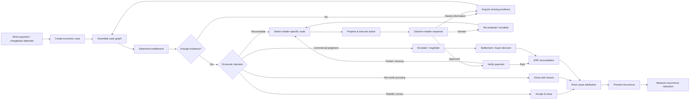
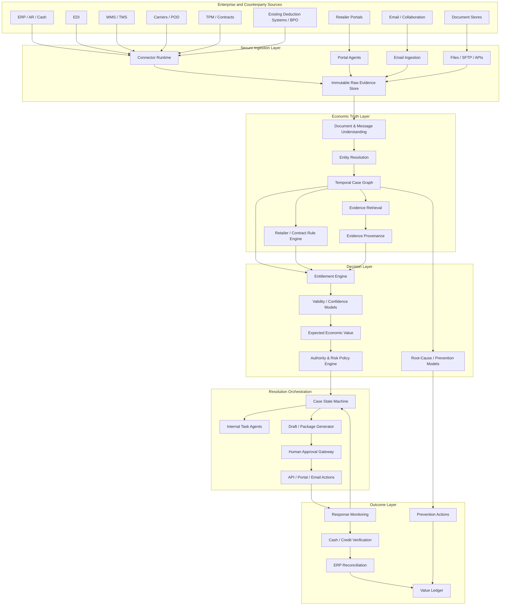
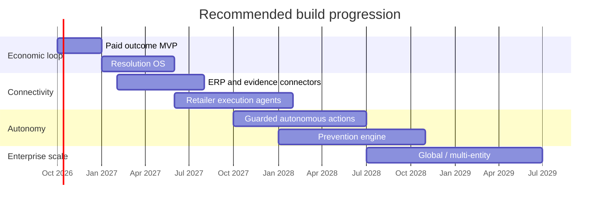
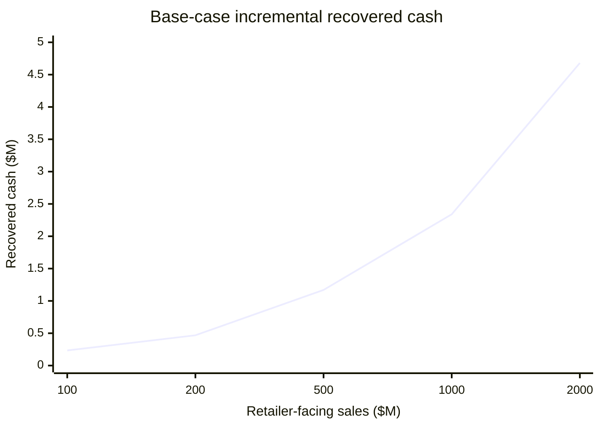

# Perfect End-State Product for Unresolved Retailer Deductions

## Executive summary

The binding methodology says that, once an economic wedge has survived enough research to justify product design, the correct sequence is **desired perfect economic outcome → perfect end-state product → minimum complete outcome loop → minimally profitable MVP**. It also requires us to design around the exact economic failure rather than around a software category. fileciteturn0file0

Applied literally here, the economic failure is not “deduction management is manual.” It is:

> **A retailer has withheld money from a supplier; the supplier cannot efficiently establish economic truth, obtain the evidence and authority required to act, navigate the retailer-specific resolution path, and drive the case to a financially final outcome before the money is written off or the recovery window closes.**

That failure is real enough to appear in current financial reporting. Hain Celestial's fiscal-2026 10-K says it estimates unauthorized customer deductions it expects to collect and records a chargeback receivable, with differences between estimated and actual collections recognized in earnings. citeturn14search1 Current operating evidence is stronger still: Campbell's is hiring a Deduction Analyst to investigate complex deductions, work across Supply Chain, Sales and Finance, direct Accenture deduction analysts, and specifically own high-priority and escalated deductions coming from Accenture and other external partners. citeturn18search0 Johnson & Johnson was advertising a senior dispute-management role in September 2026 for end-to-end ownership of high-value/high-risk disputes, including investigation, root-cause analysis, negotiations, financial adjustments and escalations across functions. citeturn17search6

The research also makes clear that **the obvious software is already being built**. HighRadius publicly documents portal/email claim capture, AI validity prediction, promotion matching, automatic POD aggregation, dispute preparation/submission, ERP/TPM settlement and root-cause analysis. citeturn23view1 SPS Revenue Recovery documents automated evidence retrieval, retailer-specific workflows, validation, recovery and prevention. citeturn23view2 UpClear now offers an inexpensive AI document/research product that ingests remittances, contracts, PODs and bills of lading, structures them with AI and produces dispute packages. citeturn16view6 Newer entrants such as Finortal and Valence are already advertising AI classification, contract validation, evidence assembly, auto-filing, cash application and root-cause analysis. citeturn20view0turn20view2

Therefore the perfect product cannot merely be **“AI that reads deduction documents and files disputes.”** That product is already becoming commodity functionality.

The end-state product should instead be an **Economic Resolution Operating System** for retail revenue exceptions:

> **For every retailer deduction, determine what the supplier is economically entitled to, construct the complete evidence-backed case, obtain missing information from wherever it lives, choose the economically correct resolution path, execute every permissible action, adapt to retailer responses, verify actual cash recovery or correct financial closure, and eliminate recurring root causes upstream.**

The target end-state is not “100% of deductions disputed.” It is:

> **100% of deductions reach a justified terminal state; recoverable dollars are recovered, valid deductions are closed correctly, commercially discretionary cases are deliberately escalated or settled, and repeatable causes are prevented—with humans involved only where judgment, authority, trust or commercial relationships genuinely require them.**

That distinction is essential. A perfect product cannot force Walmart, Target or another counterparty to pay. Retailer processes include true external authority boundaries: for example, current Walmart guidance says some deductions cannot be pursued through APDP and must instead go to a buyer, who has authority to authorize payback but no obligation to do so; it even recommends considering the relationship and “social capital” cost of requesting repayment. citeturn16view3 After an approved Walmart dispute is only partially paid, SPS's workflow documentation says it cannot simply be disputed again; the remaining amount must be taken to Enterprise Business Systems case by case. citeturn16view4 Target likewise has a separate escalation path for repeatedly denied disputes, and some deduction classes have expiration windows. citeturn16view5

So **“completely solve” means eliminate unresolvedness on the supplier side**, not magically eliminate counterparty discretion. Every case should end as one of four states:

| Terminal economic state | Meaning |
|---|---|
| **Recovered and reconciled** | Cash/credit arrived, was matched to the case, and accounting was updated. |
| **Valid and closed** | Evidence shows the retailer was economically correct; no more recovery effort is justified. |
| **Commercially resolved** | A buyer/AP negotiation, settlement or concession produced an intentional economic outcome. |
| **Unrecoverable with cause** | Recovery is no longer rational or possible; the exact reason, evidence and prevention action are recorded. |

The recommended initial ICP is **North American CPG, food/beverage, beauty/personal-care, household and other consumer-product suppliers with roughly $500 million–$5 billion of retailer-facing sales, multiple large retailers/distributors, and an existing deduction team, BPO or specialist platform**. This is a design recommendation rather than a validated incidence threshold. The rationale is that the wedge is strongest where ordinary automation already exists but complex exceptions remain. Campbell's current operating model—SAP/HighRadius familiarity, an internal deduction team, Accenture/offshore analysts and residual escalations—is almost a textbook example of the organizational topology this product is designed to replace or radically compress. citeturn18search0

The economic buyer should be the **Controller, VP Finance, VP/Director of Order-to-Cash, Shared Services leader or senior AR/revenue-reconciliation owner**. The daily users become deduction analysts, AR managers, trade-promotion finance, logistics, sales/customer teams and, eventually, the product's own autonomous agents. Current job postings show deduction resolution spanning Finance, Sales, Supply Chain, Logistics, Commercial and customer operations rather than living in one clean database or team. citeturn18search0turn17search2turn17search6

The strongest structural opening is therefore not a missing button. It is the combination of:

**data boundary + organizational boundary + authority boundary + long-tail workflow heterogeneity + architecture boundary.**

The economic truth may require ERP records, EDI, WMS events, carrier PODs, contracts, trade-promotion agreements, emails, retailer claims and buyer correspondence. The resolving authority may belong to a retailer portal, buyer, internal sales lead or controller. The path itself changes by retailer, deduction code and current case status. These are exactly the kinds of structural constraints the supplied methodology permits as a defensible opening. fileciteturn0file0

My central product recommendation is therefore:

> **Do not build a deduction-management dashboard. Build a system that owns economic finality.**

Its core asset should be a **case-level economic graph** joining every relevant commercial, logistics, financial and communication event to a single deduction; an **entitlement engine** that determines what should have happened; an **authority-aware action graph** that knows what can happen next; and a **closed-loop prevention engine** that turns resolved cases into upstream operational changes.

Importantly, the public research still does **not** prove all seven methodology gates. Current evidence strongly supports the workflow mechanism and structural residual, but it does not provide a representative denominator for residual incidence, a P25 distribution of residual economic exposure, or a validated population-level market count after incidence × controllability × incumbent effectiveness. That means this report supports a **product-design decision**, not the claim that the wedge is P/P/P/P/P/P/P validated. Under the user's earlier correction, those remaining unknowns should be measured by the paid MVP itself rather than by months of pre-product interviewing.

## Economic job, target customer, and complete case lifecycle

The exact job-to-be-done is:

> **When a retailer withholds money, establish the supplier's economic entitlement from all available evidence, determine the highest-value permissible next action, execute or orchestrate that action, and continue until the economic outcome is objectively final.**

The important word is **economic**. A workflow can be administratively closed while money is still missing. A retailer portal can say “approved” while only part of the amount is eventually paid. SPS's Walmart documentation explicitly describes this partial-payment case and the need for a separate EBS route afterward. citeturn16view4 Therefore an “approved dispute” is not the product's final state. **Verified payment and reconciliation are.**

Similarly, “denied” is not necessarily final. Target's current process permits repeated resubmission with supporting evidence and then a separate invalid-denial escalation when significant or repeated denials remain unresolved; the process also has different expiry windows depending on deduction type. citeturn16view5 Walmart's APDP supports some reason codes but not others, and some routes ultimately require buyer discretion instead. citeturn16view3

That suggests a lifecycle that is richer than the traditional open/disputed/closed model:

The product should track case state at the **claim-line level**, not merely the deduction level. Current Walmart APDP workflows can contain multiple claim lines and different statuses, while historical/current processes may span multiple systems. That kind of fragmentation is precisely what makes a unified case graph useful. citeturn16view3

**Recommended customer segmentation**

| Segment | Recommended treatment | Why |
|---|---|---|
| **Beachhead: $500M–$5B consumer suppliers** | Highest priority | Enough retail volume for meaningful residual dollars; likely to have dedicated AR/deduction operations; complex retailer mix. |
| **Large enterprise: $5B+** | Expansion | Very high economic exposure, but longer security/integration/procurement cycles and greater incumbent penetration. |
| **Growth brands: $100M–$500M** | Later low-touch product | Can benefit from complete automation, but per-account residual pool and enterprise ACV may be smaller. |
| **Very small brands** | Not initial target | Document automation alone is becoming inexpensive and may support only low ACVs. |

The exact revenue cutoffs above are product-design assumptions, not Gate-One evidence. It is notable that one current AI entrant explicitly positions itself at $200 million–$2 billion CPG companies, which is evidence that the mid-market is already being targeted, not evidence that its economics are validated. citeturn20view0

The stronger initial positioning is therefore **post-incumbent hard exceptions for larger suppliers**, where competition has fewer ways to dismiss the entrant as a generic cheaper replacement.

Current human work supports this. Campbell's current job description has the internal analyst investigating complex non-trade deductions, owning escalations from Accenture and external partners, coordinating with offshore analysts, managing SAP balances, and working across Logistics, Supply Chain, Order Management, Sales and Finance. citeturn18search0 Ocean Spray's current Customer Operations role similarly spans EDI monitoring, pricing, inventory, transportation, deductions, AR/Credit coordination, customer portals and root-cause analysis. citeturn17search2 J&J's current senior dispute role explicitly owns complex/high-value disputes, negotiations, root-cause analysis and financial adjustments across Customer Service, Sales, Supply Chain and Finance. citeturn17search6

That is evidence of the **organizational/data boundary**: there is no single application whose database is automatically identical to economic truth.

The end-state case should therefore contain at least:

| Object | Essential fields |
|---|---|
| Deduction / claim | Retailer, claim ID, reason code, amount, dates, status, expiry, line-level details |
| Invoice | Invoice/line, price, quantity, terms, credits, open amount |
| PO | PO/line, ordered quantity, cost, allowances, ship-to, requested dates |
| Shipment | Shipment ID, ASN, SKU, quantity, ship date, routing, carrier |
| Delivery | POD, signed quantity, timestamps, receiving exceptions, damage/OS&D |
| Contract / promotion | Effective dates, rates, funding, terms, retailer/customer scope, approvals |
| Remittance / payment | Payment ID, invoice allocations, deduction link, repayment/credit amount |
| Retailer evidence | Portal backups, receiving records, compliance data, claim documents |
| Communications | Email threads, buyer/AP responses, approvals, denial rationales |
| Internal decisions | Evidence reviewed, confidence, action, approver, rationale |
| Outcome | Amount recovered, date, payment proof, write-off/settlement, root cause |
| Prevention | Responsible process, corrective action, owner, recurrence result |

The product becomes much more defensible when these are represented as a **temporal economic graph** rather than a collection of uploaded PDFs.

A deduction then becomes a structured claim:

> Retailer claims **X** happened, contract/rule **Y** makes that worth **$Z**, events **A/B/C** support or contradict the claim, evidence **D** is missing, route **R** is legally/commercially available, deadline **T** remains, and expected incremental recovery from the next action is **V**.

That is the minimum representation required for genuine machine reasoning about the case.

## End-state product specification and incumbent gap

The product should have six visible user surfaces, but a single underlying case model.

**The Executive Recovery Control Tower** should answer four questions immediately: how much money is at risk, how much is likely recoverable, what is blocking recovery, and what has been recovered/prevented because of the system. It should not lead with “number of AI insights.”

**The Case Workbench** should show the complete economic story of one deduction: timeline, linked documents, extracted facts, contradictions, contract/rule basis, missing evidence, recovery probability, deadline, recommended route and the exact evidence behind every conclusion.

**The Action Inbox** should contain only things genuinely requiring humans: approve a high-dollar filing, answer a commercial question, provide inaccessible evidence, choose whether to use buyer goodwill, approve a settlement or authorize a write-off.

**The Retailer Policy Engine** should maintain versioned rules by retailer, deduction code, portal, evidence requirement, resubmission path, expiry window and escalation authority. Current Walmart and Target workflows show why this cannot merely be an LLM prompt; permissible actions depend on code, state and timing. citeturn16view3turn16view5

**The Root-Cause and Prevention Studio** should aggregate resolved cases into upstream causes—pricing master-data errors, ASN failures, shortage/receiving mismatches, promotion setup errors, routing/compliance failures, contract ambiguity—and assign corrective actions to Sales, Trade, Logistics, EDI or Finance.

**The Audit and Value Ledger** should show every dollar entering the workflow and its final outcome, making pricing, ROI and controls auditable.

The product needs the following integration surface:

| Source | What the product needs | End-state mode |
|---|---|---|
| **ERP: SAP, Oracle, NetSuite, Dynamics** | AR, invoices, customer master, deductions, credits, write-offs, payment status | Bi-directional after approval controls mature |
| **EDI** | PO, invoice, ASN, remittance and acknowledgments | Streaming/event ingestion |
| **Retailer portals** | Claims, backup docs, status, disputes, tickets, receiving data | API where available; guarded browser agents otherwise |
| **WMS** | Pick/pack/ship quantities, lot/SKU, warehouse events | Read + prevention actions |
| **TMS / carriers** | Shipment status, POD, BOL, delivery exceptions | API/email/portal connectors |
| **Contracts / TPM** | Pricing, promotional terms, funding, allowances, approvals | Structured extraction + native integrations |
| **Email / collaboration** | Retailer responses, buyer approvals, internal evidence | Scoped OAuth/service mailbox |
| **Document repositories** | PDFs, spreadsheets, agreements, images | SFTP/object-store/Drive/SharePoint connectors |
| **Existing deduction systems/BPOs** | Residual queue, history, statuses, outcomes | Read-first coexistence |
| **Bank/cash application** | Actual repayment/credit proof | Outcome verification |

The breadth is not hypothetical feature bloat. HighRadius's current product already documents data aggregation from portals, email, ERP and trade systems, carrier POD aggregation, promotion matching and ERP/TPM settlement. citeturn23view1 SPS similarly documents automated retrieval, retailer-specific workflows and recovery/prevention. citeturn23view2 The perfect product has to assume those features are table stakes.

That is why the competitive comparison is sobering:

| Capability | HighRadius | SPS Revenue Recovery | UpClear Express | New AI entrants | Required end state |
|---|---|---|---|---|---|
| Capture deductions / claims | Documented | Documented | Upload/doc-centric | Documented by several | **Yes** |
| Portal/email ingestion | Documented | Documented | Limited/self-service | Increasingly documented | **Yes** |
| Document understanding | Documented | Documented | Documented | Documented | **Yes** |
| Validity prediction / matching | Documented | Documented | Document research/validity | Documented | **Yes** |
| POD / shipping evidence | Documented | Documented | Can ingest POD/BOL | Some entrants document it | **Yes** |
| Trade/contract validation | Documented | Partner logic | Broader product supports TPM | Documented by entrants | **Yes** |
| Build dispute packet | Documented | Documented | Documented | Documented | **Yes** |
| Submit / auto-file dispute | Documented | Documented workflows | Express does not integrate | Some entrants claim auto-file | **Yes** |
| ERP/cash reconciliation | Documented | Broader ecosystem/integration | Not Express | Some entrants | **Yes** |
| Root-cause analytics | Documented | Documented | Limited in Express | Documented | **Yes** |
| **Post-denial authority graph** | Not clearly evidenced in reviewed public docs | Retailer knowledge exists; full automation not evidenced | Not evidenced | Not clearly evidenced | **Core differentiator** |
| **Partial-payment economic follow-through** | Not clearly evidenced | Tracks partial payment; Walmart next step remains external/manual | Not evidenced | Not clearly evidenced | **Core differentiator** |
| **Relationship-aware pursue/stop decision** | Not clearly evidenced | Partner expertise, but no public full decision model | Not evidenced | Not evidenced | **Core differentiator** |
| **Cross-functional evidence acquisition agent** | Some assignment/workflow capability | Evidence automation | Document-centric | Mixed | **Core differentiator** |
| **Verified economic finality rather than workflow closure** | Partial | Partial | No | Mixed | **Core differentiator** |
| **Closed-loop prevention with measured recurrence effect** | Root-cause capability documented | Root-cause/prevention documented | Limited | Claimed by some | **Must go beyond analytics** |

“Not clearly evidenced” in this table deliberately does **not** mean “the vendor cannot do it”; it means the capability was not established by the reviewed public product material. That is consistent with the supplied methodology's requirement not to invent a structural gap from a missing feature page. fileciteturn0file0 HighRadius's current scope is already very broad, including AI claim capture, validity prediction, automatic POD aggregation, dispute submission and ERP updates. citeturn23view1 SPS also already covers automated retrieval, retailer-specific workflows, root cause and recovery. citeturn23view2

UpClear shows how quickly basic document automation is commoditizing: its Express product currently offers a $100 pack covering 400 documents and can ingest deduction invoices, promotion contracts, shipment invoices, PODs and bills of lading, structure them with AI and assemble a proof package. citeturn16view6

And emerging entrants are moving fast. Finortal advertises ingestion via EDI/email/portal exports, AI classification, contract cross-referencing, dispute-package creation, workflow automation and cash application for mid-market CPG. citeturn20view0turn20view1 Valence advertises contract validation, automatic dispute filing, ERP/retailer integrations, root-cause analysis, cash application and human oversight on high-value disputes. citeturn20view2turn20view4 These are vendor claims, not independent proof of effectiveness, but they are highly relevant evidence for **incumbent feature creep**.

Therefore the true perfect-product moat needs to sit one layer deeper:

> **Not “we know how to dispute a deduction,” but “we can reconstruct the economic state of a retailer relationship and safely drive every exception to its economically optimal final state.”**

The end-state automation model should be graduated:

| Task | End-state automation |
|---|---|
| Read documents / extract facts | Autonomous, with confidence thresholds |
| Link PO/invoice/shipment/payment/claim | Autonomous |
| Retrieve routine evidence | Autonomous |
| Apply deterministic contract/rule logic | Autonomous |
| Detect contradictions | Autonomous |
| Recommend valid/invalid/uncertain | Autonomous with provenance |
| Pursue low-risk, proven retailer workflows | Autonomous under customer policy |
| Request missing internal evidence | Autonomous |
| Resubmit routine disputes | Autonomous within policy |
| Monitor portals/email/payment | Autonomous |
| Reconcile verified repayment | Autonomous within accounting controls |
| Write off material dollars | Human approval |
| Contact retailer buyer using relationship capital | Human approval |
| Accept negotiated commercial concession | Human approval |
| High-dollar/novel/legal dispute | Human approval |
| Change upstream ERP/WMS/EDI rules | Human-approved change management |

The product should aspire to **exceptionless process ownership, not humanless operation**.

## Technical architecture, AI stack, authority controls, and security

The architecture should be event-driven, case-centric and deterministic where money is concerned. Large language models should interpret ambiguous language and documents; they should not be the authoritative ledger.

The required ML/AI components are distinct, and treating them as one “agent” would create unnecessary risk.

| Component | Technical role | Recommended approach |
|---|---|---|
| **Document understanding** | Extract invoices, remittances, PODs, BOLs, contracts, portal screenshots, denial letters | Vision-language/document model + schema validation + deterministic checks |
| **Entity resolution** | Match retailer claim ↔ invoice ↔ PO ↔ shipment ↔ SKU ↔ payment ↔ promotion | Rules + fuzzy/probabilistic matching + learned match model |
| **Contract/term extraction** | Convert agreements/promotions into effective-dated obligations | LLM extraction into constrained schemas, then human-approved rules |
| **Evidence retrieval** | Find the exact supporting sentence/page/event | Hybrid lexical/vector retrieval over permission-filtered evidence |
| **Entitlement reasoning** | Compute what should have been paid | Deterministic arithmetic/rules first; AI only for ambiguous terms |
| **Validity model** | Estimate valid/invalid/uncertain and required research | Calibrated supervised model + policy rules + evidence-backed LLM explanation |
| **Expected-value model** | Prioritize whether to pursue | Dollar amount × recovery probability × timing, adjusted for cost/expiry/relationship policy |
| **Action planner** | Choose legal/operational next step | Explicit state graph and retailer policy engine, with LLM assistance inside permitted edges |
| **Portal automation** | Retrieve/submit/monitor | API first; deterministic browser automation second; vision/LLM fallback |
| **Root-cause model** | Cluster recurring causes | Structured causal taxonomy + anomaly/sequence models |
| **Causal prevention layer** | Determine whether operational intervention reduced deductions | Cohort/pre-post and quasi-experimental measurement where feasible, not LLM assertion |
| **Continuous learning** | Improve routing and prediction | Outcomes + human overrides + retailer rule changes, with controlled retraining |

The **entitlement engine** is the technical heart of the product. It should answer questions such as:

> What quantity was ordered? What quantity was shipped? What was acknowledged? What was received? What did the contract permit? What price was in force? Was the promotion active? Which event produced the retailer's claimed variance? Which evidence contradicts it?

The system should distinguish **facts**, **inferences** and **commercial assumptions**. A POD saying 1,000 cases were delivered is a fact artifact. An inference that a receiving discrepancy is therefore a retailer error requires additional reasoning. A decision to spend buyer goodwill to pursue $3,000 is a commercial policy choice.

Every generated conclusion should therefore expose:

**claim → supporting evidence → contradictory evidence → rule → calculation → confidence → permissible next actions.**

This is not merely good explainability. It is necessary for financial controls.

The **authority engine** should be treated separately from the reasoning model. Current Walmart processes demonstrate why: some deductions can flow through APDP, some require other routes, and some ultimately require a buyer who has discretion rather than an obligation to issue repayment. citeturn16view3 Target's repeated-denial escalation similarly exists only after earlier attempts and has its own submission and monitoring path. citeturn16view5 An AI model may correctly determine that money is owed but still have no authority to create the economically final outcome.

So each potential action needs structured metadata such as:

> `actor_allowed`, `customer_approval_required`, `retailer_route`, `dollar_limit`, `novelty`, `relationship_risk`, `expiry`, `required_evidence`, `rollback_possible`, `audit_requirement`.

The **human-in-the-loop system** should become narrower as empirical reliability rises rather than being removed by declaration. A practical progression is:

**Shadow mode → draft-only → one-click approved execution → policy-bounded autonomy → autonomous routine cases with exception-only review.**

A customer's policy might eventually say:

> Automatically submit Walmart shortage disputes below $15,000 only when PO, ASN and carrier POD reconcile, model confidence exceeds the agreed threshold, the route has previously succeeded, no commercial escalation is required and all evidence fields pass validation.

But a $400,000 pricing dispute involving an ambiguous promotion agreement stays human-approved.

The security bar must be enterprise-grade because the product needs finance data, contracts, emails and eventually retailer credentials. Current category leaders already market mature assurance programs; HighRadius's trust center lists ISO/IEC 27001:2022, SOC 1 Type 2, SOC 2 Type 2 and SOC 3, among other programs. citeturn16view8 That makes SOC 2-level controls effectively a competitive requirement for serious enterprise adoption, even though certification itself does not prove product security.

The architecture should use zero-trust principles: NIST SP 800-207 explicitly rejects implicit trust based on network location and calls for authentication and authorization before establishing sessions to enterprise resources. citeturn23view0

The minimum enterprise security design should therefore include tenant isolation, encryption at rest/in transit, SAML/OIDC SSO, SCIM provisioning, fine-grained RBAC/ABAC, short-lived service credentials, a hardened secrets vault for portal credentials, customer-controlled retention/deletion, immutable audit logs, region controls, subprocessor transparency, penetration testing, model/data isolation and explicit contractual prohibition on training shared models from customer content without permission.

Portal automation deserves a separate security boundary: credential workers should not expose credentials to general-purpose LLM contexts; MFA should use delegated/customer-approved mechanisms; actions should be idempotent where possible; screenshots and DOM/event traces should be retained as evidence of what the agent did.

## Implementation roadmap from minimally profitable MVP to perfect product

The supplied methodology says the MVP should start read-only, produce an auditable economic outcome, avoid rip-and-replace, keep consequential actions human-approved, prove value quickly and charge from the first pilots. fileciteturn0file0

That remains exactly right. The roadmap should **not** begin by building fifty integrations.

The engineering estimates below are planning estimates, not external benchmarks. “Engineer-month” means one full-time engineering-equivalent month and excludes founder sales, dedicated deduction-domain operations and customer procurement time.

| Stage | Product outcome | Major build | Estimated effort | Calendar with parallel team |
|---|---|---|---:|---:|
| **Outcome MVP** | Prove that unresolved cases can be economically resolved | CSV/XLSX + document ingestion, case graph v1, evidence extraction, pursue/close recommendation, missing-evidence detection, dispute draft, outcome ledger | **12–18 engineer-months** | ~8–12 weeks |
| **Resolution OS** | Replace analyst investigation for selected retailers | Email/SFTP/read-only ERP, entity resolution, workflow state machine, policy packs, internal evidence requests, payment tracking | **30–50 incremental** | ~3–5 months |
| **Connected execution** | Execute end-to-end with approval | ERP/EDI/WMS/carrier integrations, retailer connectors, credential vault, portal retrieval/submission, reconciliation | **55–85 incremental** | ~5–8 months |
| **Guarded autonomy** | Humans handle only high-risk exceptions | Reliability scoring, automated actions under policy, dynamic escalation, partial-payment follow-up, robust portal agents | **70–110 incremental** | ~6–9 months |
| **Prevention platform** | Stop repeat deductions upstream | Root-cause graph, intervention workflow, causal measurement, prevention write-backs, process scorecards | **60–100 incremental** | overlaps months 12–24 |
| **Enterprise/global product** | Multi-entity, multi-country, broad retailer coverage | Multi-currency, global rules, advanced security/admin, connector SDK, SRE, localization, compliance | **100–160 incremental** | ~12 additional months |

A polished multi-retailer enterprise platform is therefore plausibly a **24–36 month product journey**, even with meaningful parallel staffing. The point is not to wait 36 months for revenue; the first paid economic loop should exist in roughly one quarter.

The **MVP should be dramatically smaller than the perfect product**.

Its workflow should be:

> customer exports unresolved/denied deductions → uploads supporting folders → system builds economic cases → system identifies recoverable/valid/uncertain cases → retrieves or asks for missing evidence → produces exact next action and package → human executes/approves → system records final recovery → customer pays.

The MVP needs only enough product to answer the question the methodology still cannot answer from public evidence:

> **How many dollars in a sophisticated supplier's post-incumbent unresolved queue are actually software-controllable?**

A correct first implementation should therefore instrument every case with:

`gross exposure → incumbent status → root cause → evidence availability → controllability → recommendation → human intervention → external action → result → cash recovered → time → software/manual cost`.

That turns the product into the research instrument.

A useful MVP screen might look conceptually like:

| Case | Amount | Our judgment | Why | Missing | Next action | Expected value |
|---|---:|---|---|---|---|---:|
| Walmart shortage | $48,200 | Pursue | PO/ASN/POD reconcile; retailer receiving differs | None | Submit evidence-backed shortage challenge | $35,100 |
| Target pricing | $31,400 | Investigate | Invoice vs PO variance; promotion terms ambiguous | Sales approval email | Request from account team | $14,000 |
| Kroger allowance | $12,900 | Close | Contract explicitly permits charge | None | Accept/write off | $0 |
| Walmart partial pay | $76,000 remaining | Escalate | Prior dispute approved but repayment incomplete | None | EBS case / tracked escalation | $58,000 |

The exact numbers in that example are illustrative, but the shape of the output matters: the product should always express an **economic decision**, not merely a category.

The first roadmap milestone should therefore be **verified dollars**, not “model accuracy.”

## Economic impact, residual ARR sensitivity, pricing, GTM, and KPIs

The supplied methodology defines the core account economics as:

> `Residual economic value/account = E × C × R`

where **E** is gross exposure, **C** is software-controllable share and **R** is what incumbents still leave unresolved. It also caps defensible pricing, absent stronger direct evidence, at 20% of residual economic value and requires a bottom-up residual-market model rather than a headline TAM. fileciteturn0file0

Public evidence is not strong enough to populate all of those variables as validated Gate-Two/Gate-Three numbers. That needs to be said plainly.

SPS currently states in its recovery estimator that deduction fees “typically” range from 1%–5% of sales, while elsewhere on the same product page it uses a broader 5%–7% revenue-loss claim and advertises recovery metrics. Those are **vendor-promotional claims**, not Tier-A evidence, so I use 1%–5% only as an explicit scenario range rather than treating it as a proven population statistic. citeturn23view2

Hain's 2026 10-K provides much stronger evidence that unauthorized deductions and later recoveries are a real accounting phenomenon, but it does not disclose enough case-level data to estimate P25 residual exposure for our ICP. citeturn14search1

The economic model below is therefore a **decision sensitivity model**, not a hard-gate pass.

For a $500 million retailer-facing supplier:

| Variable | Conservative | Base | Upside |
|---|---:|---:|---:|
| Retailer-facing sales | $500M | $500M | $500M |
| Gross deduction rate | 1% | 3% | 5% |
| Gross deductions | $5.0M | $15.0M | $25.0M |
| Residual after current process | 10% | 20% | 30% |
| Residual dollars | $0.50M | $3.00M | $7.50M |
| Software-controllable share | 40% | 60% | 75% |
| Controllable pool | $0.20M | $1.80M | $5.63M |
| Realized recovery rate | 50% | 65% | 75% |
| **Incremental cash recovered** | **$0.10M** | **$1.17M** | **$4.22M** |
| **20% value-price ceiling** | **$20K** | **$234K** | **$844K** |

The unvalidated variables that matter most are clearly not the headline deduction rate. They are:

> **residual after competent incumbents × software controllability.**

That is exactly what the paid MVP must measure.

Holding the base assumptions constant—3% deduction rate, 20% residual, 60% software-controllable and 65% of controllable dollars actually recovered—the model scales like this:

| Retailer-facing sales | Incremental recovered cash | 20% value ceiling |
|---:|---:|---:|
| $100M | $234K | $46.8K |
| $200M | $468K | $93.6K |
| $500M | $1.17M | $234K |
| $1B | $2.34M | $468K |
| $2B | $4.68M | $936K |

Those values deliberately exclude labor savings, financing benefits and prevented recurrence, so they avoid double counting. If prevention later proves causal and measurable, it should be added as a separate value pool only after the recurrence reduction is verified.

There is an important methodological nuance in the supplied Gate-Six rules. The methodology states both that conservative residual ARR capacity should be at least **5× the ₹800 crore target annual revenue**, approximately ₹4,000 crore, **and** that target revenue must be achievable with no more than **15% penetration**. fileciteturn0file0

Those conditions are not equally restrictive. At ₹800 crore:

> ₹800 crore ÷ 15% = **₹5,333 crore**

So the ≤15% penetration requirement actually implies a stricter minimum residual ARR capacity of about **₹5,333 crore**, not ₹4,000 crore. At roughly ₹96 per U.S. dollar on September 29, 2026, that is approximately **$556 million** of residual ARR capacity; the ₹4,000-crore 5× threshold is about $417 million. The rupee was trading around the 96-per-dollar level on the current date. citeturn21news21

That produces an unusually useful market test.

At the base modeled value ceiling of $234,000 per $500M account:

| Accessible affected accounts after incidence/GTM filters | Residual ARR capacity | Penetration required for ~$83M target revenue |
|---:|---:|---:|
| 500 | $117M | ~71% |
| 1,000 | $234M | ~36% |
| ~1,780 | ~$417M | ~20% |
| **~2,375** | **~$556M** | **~15%** |
| 3,000 | $702M | ~12% |

So under this base economic model, **roughly 2,375 genuinely affected, reachable accounts with ~$234K defensible ACV would be required to satisfy the stricter Gate-Six condition**.

That is not yet proven.

The U.S. Census gives enough breadth to make the denominator plausible but not enough to pass the gate. The 2022 Economic Census reports 24,888 firms and 29,780 establishments in Food Manufacturing alone, with more firms in beverages, household products, apparel, health-related products and other retailer-supplier sectors. citeturn22search3turn22search11 Census SUSB is the appropriate enterprise-level source because it reports firms by industry and enterprise size, but the published data lag and the required filtering for size, retail exposure, incumbent usage and actual residual grievance still must be done. citeturn16view7

The required accessible-account count changes dramatically with ACV:

| Defensible ACV | Accessible affected accounts needed for ~$556M capacity |
|---:|---:|
| $50K | ~11,111 |
| $100K | ~5,556 |
| $150K | ~3,704 |
| **$234K** | **~2,374** |
| $300K | ~1,852 |
| $400K | ~1,389 |
| $500K | ~1,111 |

This is why the first several customers need to measure residual dollars rigorously. If the real post-incumbent ACV ceiling is $50,000, the business may struggle to satisfy the original company-size objective. If it is $200,000–$500,000 for thousands of accounts, the platform thesis becomes much more credible.

**GTM should enter through the unresolved queue, not replacement.**

The offer should be:

> **Give us six to twelve months of unresolved, denied or repeatedly escalated deductions from your current process. We will reconstruct the cases, identify what is economically recoverable, and drive selected cases to a verified outcome without replacing your ERP or existing deduction system.**

That directly follows the supplied methodology's ideal entry architecture: historical/read-only data → independent analysis → economically measurable result → customer verifies → customer pays → deeper integration. fileciteturn0file0

A paid first engagement should require only CSV/XLSX/SFTP exports plus documents and optionally read-only APIs. That lets the company coexist with HighRadius, SPS, SAP or an Accenture BPO rather than requiring the buyer to admit that its current stack was a mistake.

The best sales trigger is probably one of four situations:

| Trigger | Sales message |
|---|---|
| Large aged unresolved queue | “Let us attack what your current process has already failed to close.” |
| BPO/analyst cost pressure | “Keep your systems; eliminate the exception investigation layer.” |
| Major retailer denial pattern | “Give us the denied cases; we'll determine the recoverable subset and escalation path.” |
| CFO margin/cash initiative | “Convert existing AR leakage into measurable cash without an ERP project.” |

Campbell's current use of internal staff plus Accenture/offshore deduction analysts provides primary operating evidence that labor/BPO spending exists around exactly this kind of workflow, although it does not disclose enough spend to establish Gate Four quantitatively. citeturn18search0

Pricing should be tested through the three mechanisms required by the methodology rather than chosen philosophically. fileciteturn0file0

| Pricing experiment | Suggested initial test | What it learns |
|---|---:|---|
| **Paid diagnostic** | $20K–$40K for a defined historical unresolved queue | Will customer pay merely to identify/resolve hidden recoverable value? |
| **Fixed subscription** | ~$75K–$200K/year for a mid-sized initial deployment | Is the job budgetable as recurring infrastructure? |
| **Base + outcome fee** | $50K–$100K base + 8%–12% of verified incremental recovery, subject to value ceiling | Does objective economic attribution support aligned pricing? |
| **Enterprise platform** | $250K+ only when measured residual economics support it | Can expansion, integrations and prevention support high ACV? |

These are **experiments**, not evidenced market prices. The 20% residual-value ceiling from the supplied methodology should constrain pricing until direct revealed-WTP evidence justifies something else. fileciteturn0file0

A $500M customer matching the base model produces $1.17M of incremental recovered cash, implying a ~$234K maximum annual value-capture ceiling under that rule. At the conservative scenario, the same customer supports only ~$20K. That variance is precisely why a single fixed price should not be assumed before real case data exists.

The KPI tree should be ruthlessly economic:

| KPI family | Primary metrics |
|---|---|
| **Cash** | Incremental dollars recovered; net recovery after fees; repayment actually received |
| **Closure** | % of deductions reaching justified terminal state; aged unresolved dollars |
| **Accuracy** | False dispute rate; correct-close rate; overturned recommendations |
| **Speed** | Median/P90 time to resolution; days deduction outstanding; days to first measurable finding |
| **Automation** | Touchless case share; human minutes per $1,000 resolved; actions per analyst |
| **Evidence** | Evidence completeness; entity-match precision; low-confidence case rate |
| **Counterparty** | First-pass acceptance; denial/resubmission rate; escalation rate |
| **Prevention** | Repeat deduction dollars for addressed root causes; recurrence reduction after intervention |
| **Economics** | Customer ROI; software cost per recovered dollar; vendor contribution margin |
| **Trust** | Human override rate; unauthorized-action count; security incidents; audit completeness |

The north-star metric should be:

> **Net economically resolved dollars per customer per period**

where “resolved” includes recovered cash **and correctly accepted deductions**, but those should be reported separately so the company cannot game performance by closing everything.

## Failure modes, mitigation, and methodology verdict

The opportunity has meaningful promise, but the strongest version of the research is also the most skeptical one.

The first existential risk is **there may not be enough controllable residual value after competent incumbents**. HighRadius and SPS are already broad platforms, and newer products are moving quickly toward AI-native dispute automation. citeturn23view1turn23view2turn20view1turn20view2 The product cannot survive on “our AI is better.”

The second existential risk is that the hardest remaining cases are hard **because they are commercial negotiations rather than information-processing problems**. Walmart's buyer-resolution path demonstrates this explicitly: the buyer has authority but no obligation to repay, and suppliers are advised to consider relationship/social-capital cost. citeturn16view3 Software can make those cases perfectly informed and perfectly orchestrated, but it cannot remove counterparty bargaining power.

The third is data access. The ideal case graph assumes enough evidence exists somewhere. Campbell's and Ocean Spray's operating descriptions show how many functions and systems participate in these workflows. citeturn18search0turn17search2 If the decisive truth routinely exists only in inaccessible retailer systems or unrecorded human conversations, controllability falls.

The prioritized risk register is therefore:

| Priority | Failure mode | Why it matters | Required mitigation / kill test |
|---|---|---|---|
| **P0** | Residual controllable pool too small | Kills economics | MVP measures E × C × R case by case; kill if repeat accounts cannot support target ACV |
| **P0** | Hard cases are mostly negotiation | AI cannot change bargaining power | Classify every failed case by data/authority/commercial cause; exclude negotiation from controllable pool |
| **P0** | Incumbents absorb the feature set | Feature advantage disappears | Own economic-finality graph + cross-system outcome history + authority policies, not document AI |
| **P0** | False dispute damages retailer relationship | Could destroy trust and customer value | Evidence thresholds, customer policies, high-risk approvals, relationship-cost field |
| **P1** | Missing/inaccessible data | Cases remain unknowable | Explicit evidence-completeness score; connectors; structured “cannot determine” terminal path |
| **P1** | Portal agents break | Operational unreliability | API first; deterministic connector library; monitoring; human fallback; fast rule updates |
| **P1** | Portal terms/MFA restrict autonomy | Action layer blocked | Customer-delegated access, no credential circumvention, manual approval/fallback |
| **P1** | LLM invents evidence/rationale | Financial-control risk | Evidence-bounded generation; deterministic arithmetic; source citations; no unsupported action |
| **P1** | Automation writes off money incorrectly | Direct financial loss | Write-offs/material settlements remain approval-gated |
| **P1** | Customer contests outcome-fee attribution | Pricing model breaks | Immutable baseline and value ledger; contractually defined eligible recovery cohort |
| **P2** | Each retailer becomes bespoke consulting | Gross margin collapses | Versioned policy packs and connector SDK; track manual hours; refuse non-reusable custom work |
| **P2** | “Root cause” is correlation, not cause | Prevention claims become misleading | Measure interventions and recurrence; distinguish hypothesis from verified causal result |
| **P2** | Sensitive data/credentials compromised | Enterprise-blocking event | Zero-trust access, vaulting, tenant isolation, SOC 2 program, least privilege |
| **P2** | Teams distrust autonomous actions | Product stalls at recommendation layer | Progressive autonomy and replayable evidence trail |

The product should also include an explicit **economic stop engine**. There are cases where the supplier may technically be right but pursuing another $1,000 through a discretionary buyer path costs more—in labor, relationship capital and attention—than the expected recovery. Walmart's current guidance to weigh buyer goodwill makes this more than a theoretical edge case. citeturn16view3

The ideal system should therefore be willing to say:

> **“Supplier appears economically correct, but expected value of further pursuit is negative under your commercial policy. Recommend closure.”**

That is a stronger product than a dispute robot.

The final evidence status under the binding methodology is deliberately conservative:

| Hard gate | Current status | What this research establishes | What the paid product still must establish |
|---|---|---|---|
| **Incidence** | **C** | Repeated workflow evidence exists | Denominated affected-account incidence in precise ICP |
| **Economic exposure** | **C** | Unauthorized deductions are financially real; vendor data suggest material scale | P25/median post-incumbent residual exposure |
| **Software controllability** | **C** | Strong data/workflow components are automatable; authority boundaries also proven | Root-cause Pareto and conservative controllable fraction |
| **Revealed WTP** | **C** | Companies employ analysts/BPOs and buy incumbent platforms | External spend amounts/contracts for exact residual job |
| **Residual grievance** | **C, strongest evidence** | Campbell explicitly retains complex escalations after Accenture/external partners; complex roles persist elsewhere | Representative incumbent-user denominator |
| **Residual capacity** | **C** | Broad company universe is large | Size-filtered, incidence-adjusted, GTM-adjusted bottom-up account count |
| **GTM accessibility** | **C / plausible** | Read-only historical design avoids replacement | Actual paid-entry/first-value cycle times |

“C” means conditional/unproven under the user's own methodology; only P/P/P/P/P/P/P may be called a validated economic wedge. fileciteturn0file0

The strongest conclusion is therefore narrower—and more useful—than “deductions are a huge market.”

It is:

> **There is enough primary and current operational evidence to design and build a minimally profitable product around the residual hard-exception job, but not enough evidence to justify building a full deduction-management platform before the MVP measures the remaining controllable dollars.**

And the ideal product it should be converging toward is now precise:

> **A Retail Revenue Resolution OS that maintains a continuously updated economic case graph for every deduction, knows what the supplier is entitled to, obtains the evidence needed to prove it, understands the retailer-specific authority path, executes permissible actions, adapts until payment or rational closure, reconciles the financial outcome, and changes the upstream process so the same economically avoidable deduction stops recurring.**

The “perfect” state is reached when the customer no longer has an **unresolved deduction queue** at all.

There is only:

**money the retailer owes and the system is actively recovering; money the retailer was entitled to and the system has correctly closed; commercial decisions waiting on an authorized human; and root causes the system is actively preventing.**

Everything else is automation detail.